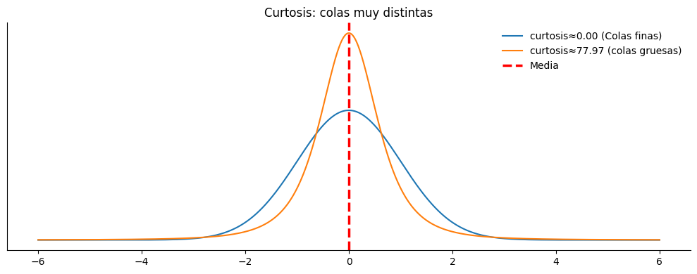

# Medidas de forma

## La trampa en de la cola

Durante meses la estrategia funcionó casi perfecta. Ganaba seguido, no ganaba mucho, pero ganaba casi todos los días. El ratio de aciertos alto y la sensación al operarla era cómoda, tranquila, casi aburrida. 

Cada trade sumaba poco: +0.3%, +0.4%, +0.2%, +0.5%.

No había grandes sobresaltos, la curva del capital subía con una pendiente prolija, constante. Yo pensaba: “esto es genial, logre convertir al mercado en una cajero automático”.

Hasta que un martes, se convirtió en uno de esos días que no se olvidan.  Un solo trade salió muy mal, en minutos, ese único evento se llevó **meses completos de trabajo**.

No fue una racha negativa, no fue una mala semana, fue **un solo día**.

Cerré la plataforma y me quedé mirando la nada, con una pregunta en la cabeza:
**¿En qué me equivoqué, si casi siempre ganaba?**

Revisando los trades me di cuenta de algo interesante: cuando ganaba, las ganancias eran chicas y parejas, pero cuando perdía, las pérdidas eran poco frecuentes pero grandes. Esas pocas perdidas eran capaces de borrar, en un solo movimiento, muchas operaciones ganadoras a la vez.

Ahí entendí que el problema no estaba en el porcentaje de aciertos, sino en la forma de la distribucion de los resultados.

La distribucion de ganancias de mi estrategia tenia una **asimetria negativa**, una cola larga hacia la izquierda. En esa cola larga es donde habitaban las pérdidas. No aparecían seguido, pero cuando aparecian eran profundas.

La cola era angosta, indicando poca frecuencia, pero la longitud de la cola me decia que las perdidas eran de alto impacto, erosionando muchas peraciones ganadoras a la vez

Como resultado, el capital de mi cuenta subia lentamente por una escalera… pero cuando tocaba perder,  descendia como en caída libre.

Exactamente lo que ocurre cuando el lado izquierdo de la distribucion es mucho mas largo que el lado derecho.

La simetría describe **hacia que lado están los eventos extremos** y cómo estos dominan el resultado final, aún cuando ocurren pocas veces.

Puede presentarse de dos formas:

* Asimetria negativa (cola izquierda):
Muchas ganancias pequeñas, pocas pérdidas enormes.

* Asimetría positiva (cola derecha):
Muchas pérdidas pequeñas, pocas ganancias extraordinarias.

La diferencia se ve claramente en el siguiente gráfico:

## ¿Cómo se siente una estrategia con cola derecha?

Una estrategia con **cola derecha** se siente casi como la opuesta a la anterior.

* Perdés muchas veces seguidas.
* Las pérdidas son chicas y controladas.
* El ratio de aciertos es bajo.
* Pasás largos períodos dudando si la estrategia realmente funciona.

Por lo tanto no es cómoda, no da seguridad emocional. no “premia” seguido. Operarla se siente **incómodo**. Da la sensación de estar siempre equivocado.

La curva del capital:

* Avanza poco,
* Retrocede seguido,
* Parece torpe,
* No entusiasma.

Pero, cada tanto, aparece **un trade distinto**: una tendencia que se extiende, un movimiento grande, una ganancia que paga muchas pérdidas juntas.

Ahí entendés que el resultado no depende de ganar seguido, sino de **capturar pocos eventos grandes**.

Si al operar una estrategia sentís que tus mejores trades son varias veces más grandes que tus pérdidas normales, entonces es muy probable que estés frente a una **distribución con cola derecha**.

Hasta aqui vimos la **asimetría**, que nos dice de qué lado están los eventos extremos. Pero además de saber de qué lado, también necesitamos saber **qué tan intensos** pueden ser esos evantos.

Por ejemplo, podemos tener:
* Una estratégia A donde los eventos extremos generan un pérdida de 2-4%.
* Y una estratégia B, donde los eventos extremos generan pérdidas del 10-12%.

**¿Qué tan intensos son esos eventos extremos cuando aparecen?**
Esa intensidad se mide a través de un valor llamado **curtosis**.

***

## Curtosis

La curtosis describe cuán “gruesas” son las colas de la distribución.

### Una curtosis alta significa:

* Durante mucho tiempo no pasa nada extraordinario, todo parece normal.

* La estrategia parece “estable”.

* Pero cuando aparece un evento extremo… **no es un susto**: es un antes y un después.

No es solo “de qué lado está la cola”.
Es **qué tan destructiva puede ser esa cola**.

Y el mercado ya nos dio múltiples ejemplos de colas extremadamente destructivas, eventos raros que no aparecen seguido, pero que cuando aparecen **redefinen todo**.

El mercado financiero tiene un historial claro de episodios de **alta curtosis**:

* La burbuja de las **punto com** en el 2000, donde años de subas ordenadas terminaron en una caída abrupta que borró empresas enteras.

* La **crisis financiera de 2008**, un evento poco frecuente que puso en jaque al sistema financiero global.

* El **COVID en 2020**, donde en cuestión de semanas se produjeron movimientos que parecían estadísticamente “imposibles”.

Eso es curtosis en el mundo real.

No se manifiesta todos los días. No se ve en promedios tranquilos. Pero cuando aparece, **hace desastres**.

Veamos la curtosis como se visualiza graficamente, en la siguiente figura:

La curva azul es una normal y tiene curtosis = 0
La curva naranja tiene una curtosis = 78 (alta)

A simple vista parece que la distribucion naranja tiene menor curtosis, porque es más alta y angosta, parece mas concentrada alrededor de la media. Pero la curtosis no se define por lo que pasa cerca del centro, sino por lo que pasa lejos, muy lejos de la media.

Si te vas mas a alla de 3, 4 o 5 DE, la curva azul cae rapidamente (casi desaparece), en cambio la distribucion naranja sigue teniendo un valor apreciable. 

### Tipos de curtosis

* **Mesocúrtica** (similar a la normal): colas estándar.

* **Leptocúrtica** (colas pesadas):\
Más valores extremos de los que “debería haber”.
Típica en series financieras reales.

* **Platicúrtica** (colas livianas): rara en mercados.

Los retornos de activos casi siempre son **leptocúrticos**, lo que significa que:
* vienen muchos días tranquilos,
* interrumpidos por saltos grandes inesperados.

## ¿Por qué estas medidas son críticas para un trader?

Porque la intuición humana tiende a asumir simetría y colas delgadas.
Pero el mercado no es así.

**En la práctica:**

* Los drawdowns profundos nacen de **asimetría negativa + curtosis alta**.
* La mayoría de los modelos clásicos fallan porque asumen **normalidad**.
* La curtosis y el skew anticipan fallas de modelos VaR, Sharpe tradicional, o estrategias que se ven “estables”.

Queremos que el lector vea el gráfico y entienda:

* **Dónde están los riesgos ocultos.**
* **Qué parte de la distribución puede matar una estrategia.**

## Resumen

En esta unidad aprendimos que el riesgo no vive en el promedio, sino en la **forma** de los resultados.

La **asimetría** nos dice de qué lado están los eventos extremos:

* estrategias cómodas pueden esconder pérdidas raras y grandes,

* estrategias incómodas pueden depender de pocas ganancias enormes.

La **curtosis** nos muestra qué tan dominantes pueden ser esos eventos extremos cuando aparecen.

El mercado no se define por lo que pasa todos los días,\
sino por **pocos episodios que lo cambian todo**.

Aprender a leer la forma de una distribución es aprender a ver el riesgo antes de que aparezca.

