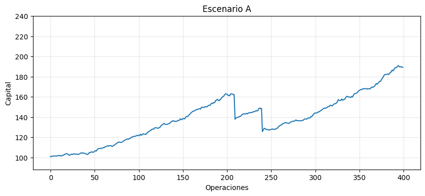
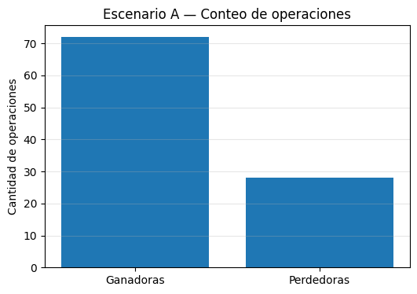
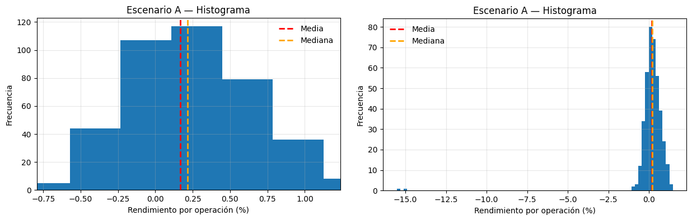
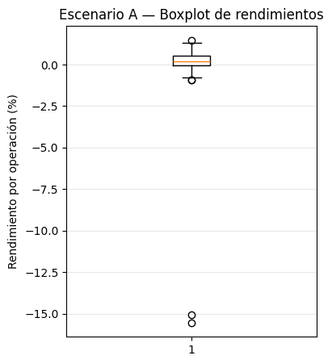
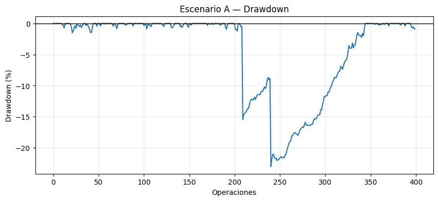

# Representaciones Gráficas (escenario A)

Llevaba un tiempo operando una estrategia en una cuenta demo, que cuidaba casi como si fuera real. Operaba sin hacer desastres, controlando el riesgo, intentando que cada decisión se pareciera lo más posible a lo que haría con dinero verdadero.

Después de un año de operatoria, acumulé un conjunto de datos: cientos de operaciones que reflejan cómo se comportó la estrategia en distintas situaciones de mercado.

Ese conjunto de operaciones es el resultado de una simulación operativa en tiempo real: operaciones ejecutadas una por una, con información disponible en cada momento y sin conocer el futuro.

Más adelante veremos que **este mismo tipo de datos** también se puede obtener a través de un **backtesting**, es decir, ejecutando la estrategia sobre datos históricos del mercado.

Con esos datos en la mano, ya no estoy opinando ni imaginando, puedo observar qué pasó, cómo se comportó la estrategia y, sobre todo, **qué tipo de problemas me puedo encontrar a futuro** cuando decida ponerla a funcionar en una cuenta real.

El primer paso que doy no es calcular indicadores ni estadísticas. Lo primero que hago es algo más simple:
**graficar la curva de capital** que se visualiza a continuación.

Al observar la curva se me vienen a mente algunas preguntas:

* ¿El capital crece de forma razonable como para considerar que la strategia es sólida?
* ¿Podría estar tranquilo operando esta estrategia con dinero real?
* ¿Que parte del gráfico me genera incomodad o tensión?
* ¿Lo que estoy viendo es resultado de una ventaja real, o simplemente una racha de suerte?

La curva de capital me mostró **cómo* crece el capital, pero no me dijo **qué tipo de operaciones** lo producen.

La curva de capital me mostró **cómo** crece el capital, pero no me dijo **qué tipo de operaciones** lo producen.

En particular, hay una pregunta que la curva no puede responder:

**¿La estrategia gana seguido o gana de vez en cuando?**

Grafico entonces la cantidad de operaciones ganadoras y perdedoras:

Este gráfico me dice **con qué frecuencia** gano y pierdo, pero todavía no me dice nada sobre **el tamaño** de esas ganancias y pérdidas.

**¿Qué tamaño tienen esas ganancias y esas pérdidas?**

Para responder eso, necesito mirar los rendimientos operación por operación. Ahí aparece el histograma.

## Histograma de rendimientos

En este histograma aparece un problema visual común: unos pocos eventos extremos comprimen la zona donde vive la mayoría de las operaciones.

Por eso conviene mirar el gráfico en dos vistas:
* Una visualiza lo que sucede cerca de cero (lo frecuente)
* Y otra que visualiza lo raro (la cola izquierda). 

Recordemos  que en los mercados, el riesgo real suele vivir en esa cola. La mayoría de los resultados ocurren en el centro, pero el **destino de la estrategia suele decidirse en los extremos**.

En este histograma aparecen dos eventos alrededor de –15%.  
Esos dos valores extremos son exactamente las dos caídas abruptas que ya habíamos visto en la curva de capital.

Al mirar este gráfico aparecen nuevas preguntas:

* ¿La ganancia de la estrategia depende de muchos aciertos pequeños?
* ¿O de pocos eventos grandes?
* ¿Qué rol juegan estos eventos extremos en la forma de la curva de capital?

Hasta ahora visualizamos los datos desde distintos ángulos:
la historia completa (curva), la frecuencia (conteo) y la forma (histograma).

Ahora quiero un resumen que me muestre **qué es normal** y **qué está completamente fuera de escala**. Para ello utilizo un boxplot.

## Boxplot

El boxplot me muestra, de forma muy directa:

* Dónde está el comportamiento típico (la mediana),
* Qué tan amplio es el rango habitual de resultados,
* Y qué valores aparecen como **outliers**, es decir, operaciones que no pertenecen al comportamiento normal de la estrategia.

En este boxplot aparecen claramente dos puntos alejados hacia la izquierda. Son exactamente los mismos dos eventos extremos que ya habíamos visto:

* en el histograma, como valores cercanos a –15%,
* y en la curva de capital, como caídas abruptas.

La diferencia es que acá el mensaje es inmediato:

> **La estrategia tiene un comportamiento típico bastante acotado, pero convive con eventos raros capaces de cambiarlo todo.**

El boxplot no me dice cuándo ocurren esos eventos, pero sí me deja algo muy claro:

**no son parte del ruido normal, son excepciones… con consecuencias grandes.**

## Drawdown

Todavía hay algo fundamental que no lo vimos:

**¿qué pasa cuando la estrategia entra en problemas?**
**¿Cuánto se pierde antes de recuperarse?**
**¿Cuánto tiempo dura ese mal momento?**

Para responder eso uso el **drawdown**.

El drawdown mide cuánto cae el capital desde su máximo histórico hasta un mínimo posterior. No habla de ganancias, habla de **pérdida acumulada**.

Al observar el gráfico de drawdown puedo ver:

* qué tan profundas son las caídas,

* si los eventos extremos son aislados o encadenados,

* cuánto tiempo tarda la estrategia en volver a su máximo anterior.

En este caso aparecen dos drawdowns profundos y bien marcados. Son exactamente los mismos dos eventos extremos que ya identificamos:

* En la curva de capital, como caídas abruptas.
* En el histograma, como valores cercanos a –15%.
* En el boxplot, como outliers.

El drawdown me permite ver algo que los otros gráficos no muestran con claridad:
**No solo cuánto se pierde, sino cuánto tiempo se permanece en pérdida.**

