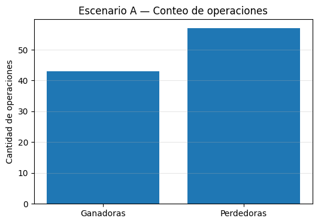
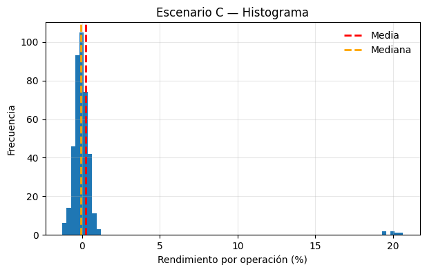
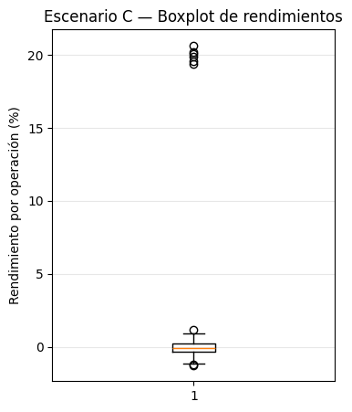

# Estrategia C: La incomoda

Hasta ahora analizamos dos estrategias con cola izquierda:

* Una agresiva e insostenible (A),
* Otra más suave y operable (B).

Pero existe otro tipo de estrategia muy distinta. Una estrategia que **se siente incómoda**:

* Pierde seguido,
* Tiene bajo ratio de aciertos,
* Genera dudas constantes,

Sin embargo, cuando gana, lo hace de forma significativa.

Esa incomodidad no siempre es un problema. A veces es el **precio psicológico** de capturar **colas derechas**.

La **estrategia C**, una estrategia difícil de operar, emocionalmente exigente, pero potencialmente muy interesante para quien logra sostenerla.

## 1. Curva de capital: crecimiento a saltos
La curva de capital de la estrategia C es la siguiente:

Durante largos tramos el capital:

* Avanza poco,
* Retrocede seguido,
* Parece estancado.

La sensación es clara: **mucho esfuerzo para poco resultado**.

Sin embargo, cada tanto ocurre algo distinto. Aparecen **saltos bruscos y positivos** que explican gran parte del crecimiento total. La estrategia no crece de forma continua: **crece por eventos**.

Esto ya anticipa una característica clave: la rentabilidad no está distribuida de manera uniforme en el tiempo.

## 2. Conteo de operaciones: perder es lo normal

Al observar el conteo de operaciones ganadoras y perdedoras, la incomodidad se vuelve explícita.

La estrategia:

* Pierde más veces de las que gana,
* Tiene un **ratio de aciertos bajo**.

Desde el punto de vista emocional, esto es difícil de sostener. La mayoría de las decisiones “salen mal”.

Este gráfico explica por qué la estrategia **se siente** incorrecta, aun cuando no lo sea.

## 3. Histograma: la cola derecha

El histograma de rendimientos muestra con claridad la forma de la distribución.

La mayor parte de las operaciones:

* Se concentra cerca de cero,
* Son pequeñas pérdidas o ganancias marginales.

Pero aparece algo fundamental: una **cola derecha larga**, con pocas operaciones muy grandes y positivas.

Estas pocas operaciones:

* No son frecuentes,
* No son predecibles,
* Pero **definen el resultado final**.

Aquí la media puede ser positiva aún cuando la mediana sea cercana a cero o incluso negativa. La estrategia vive de capturar **eventos poco comunes pero decisivos**.

## 4. Boxplot

El boxplot refuerza esta lectura.

La “caja” central es chica: la mayoría de los resultados son modestos.

Pero aparecen outliers muy claros del lado positivo. No son errores ni anomalías externas:
**son operaciones generadas por la propia estrategia**.

El boxplot no dice “esto es raro”, dice:
esto es poco frecuente, pero importante.

Eliminar estos eventos destruiría la estrategia.

## 5. Drawdown: incomodidad sostenida

El gráfico de drawdown muestra otra diferencia clave respecto a la estrategia A.

La estrategia C:

* Entra seguido en drawdown,
* Pasa mucho tiempo por debajo del máximo,
* Genera incomodidad constante.

Pero hay una diferencia crucial: las caídas son **acotadas**. No aparecen drawdowns catastróficos que destruyan la cuenta.

El riesgo no está en una pérdida enorme, sino en **abandonar antes de tiempo**.

## Conclución

La estrategia C no es cómoda.
No refuerza el ego.
No “premia” seguido.

Pero enseña algo fundamental:

**Una estrategia puede ser válida aunque se sienta mal.**

La ventaja no siempre se presenta como tranquilidad. A veces se presenta como una distribución con cola derecha que exige:

* paciencia,
* disciplina,
* y tolerancia a la duda.

La pregunta correcta frente a esta estrategia no es:
“¿Gana seguido?”

Es:
**“¿Soy capaz de sostenerla hasta que aparezcan los eventos que la hacen rentable?”**
