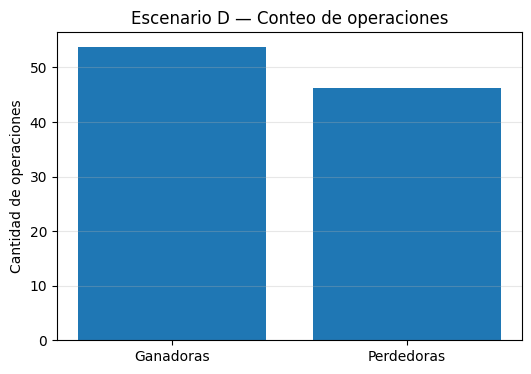
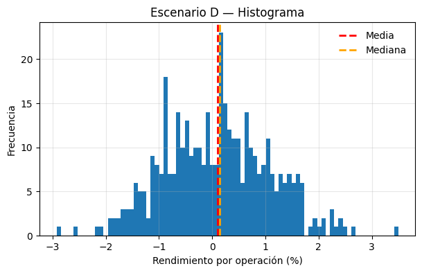
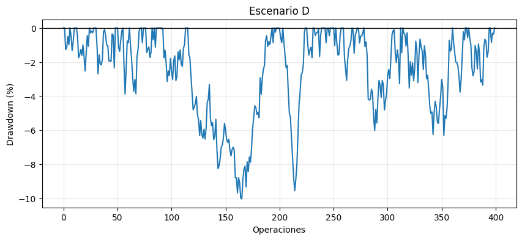

# Estrategia D: ruido vs ventaja real

Finalmente, no toda curva estable ni todo histograma prolijo es una estrategia válida.

Existe un cuarto escenario: la **estrategia D**, aquella que parece moverse, genera operaciones, produce gráficos… pero **no tiene ventaja real**.

En este caso, la forma de la distribución no es el problema.\
El problema es que **no hay estructura**: ni cola explotable, ni media significativa, ni comportamiento consistente.

## Curva de capital: movimiento sin sentido

La curva de capital de la estrategia D puede engañar al principio.

En tramos cortos parece subir.
En otros parece caer.
A veces se mantiene estable.

Pero cuando se la observa en conjunto, aparece algo claro:
**no hay estructura**.

No hay saltos que expliquen el crecimiento. No hay patrones temporales. No hay zonas donde “pasan cosas”. Es movimiento sin dirección.

## Conteo de operaciones: equilibrio vacío

El conteo de operaciones ganadoras y perdedoras suele estar cerca del 50%.

Eso puede sonar razonable, pero acá no significa nada bueno. No hay predominio de pérdidas chicas con ganancias grandes (como en C), ni predominio de ganancias chicas con pérdidas grandes (como en A).
Solo alternancia.

## Histograma: sin cola explotable

El histograma de rendimientos muestra la diferencia clave.

No aparece:

* Ni una cola izquierda profunda,
* Nin una cola derecha significativa.

La distribución es compacta, simétrica y centrada cerca de cero.

Puede haber algún valor algo más grande, pero no define el resultado. No hay eventos que carguen con el peso de la rentabilidad.

Esto no es una distribución “difícil”. Es una distribución **vacía de ventaja**.

## Boxplot: nada que rescatar

El boxplot refuerza la misma idea.

No aparecen outliers estructurales. No hay operaciones que expliquen el resultado. Todo está contenido, todo es pequeño.

Eliminar o no esos valores no cambia nada. No hay cola que proteger ni cola que suavizar.

## Drawdown: desgaste sin sentido

El drawdown de la estrategia D no es catastrófico, pero tampoco es interesante.

Hay caídas y recuperaciones constantes. Mucho tiempo en pérdida. Mucho tiempo recuperando lo perdido.
Pero sin propósito.

El problema acá no es psicológico. Es **estructural**.

## Cierre del recorrido A–B–C–D

Con estos cuatro escenarios aprendimos algo esencial:

* **A**: cola izquierda agresiva: no operable

* **B**: cola izquierda controlada: operable

* **C**: cola derecha incómoda: potencial

* **D**: sin cola: ruido

A lo largo de estos cuatro escenarios no buscamos encontrar “la mejor estrategia”.\
Buscamos algo más importante: **aprender a leer la estructura de una estrategia**.

Vimos que dos estrategias pueden:

* Tener curvas de capital similares,
* Medias parecidas,
* O resultados aceptables en el papel,

Y sin embargo ser **completamente distintas** en términos de riesgo, experiencia y sostenibilidad.

La estadística descriptiva nos permitió mirar más allá del resultado final y entender:

* **Qué tipo de pérdidas existen**,
* **Sónde vive el riesgo real**,
* **Qué eventos sostienen o destruyen una estrategia**,
* Y **si esa forma de operar es compatible con una persona real**.

Aprendimos que no alcanza con preguntar:

> “¿Gana dinero?”

Hay que preguntar también:

* ¿Cómo gana?
* ¿Cómo pierde?
* ¿Cuándo duele?
* ¿Durante cuánto tiempo?
* ¿Y quién puede sostener eso?

Los cuatro escenarios dejan una enseñanza clara:

* No toda estrategia que gana es operable.
* No toda incomodidad es una señal de ventaja.
* Y no todo movimiento es ruido… pero **mucho ruido se parece a una estrategia**.

La estadística descriptiva, usada de esta manera, no sirve para poner etiquetas. Sirve para **tomar decisiones**.
