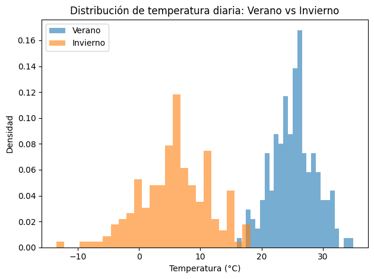
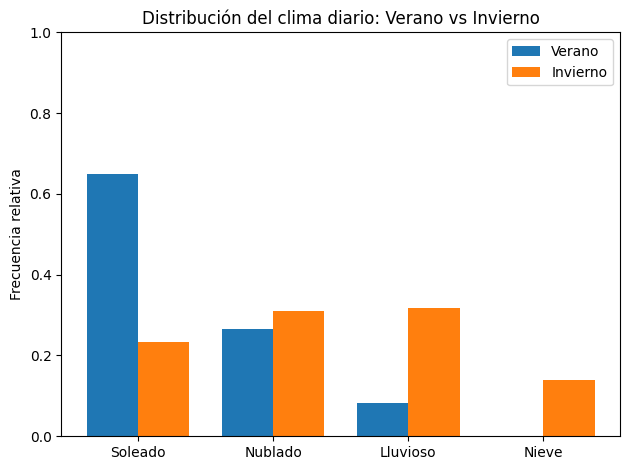

# ¿Qué es una distribución?

## Introducción
Para comenzar a hablar de distribuciones de probabilidad vamos a usar una analogía con algo conocido, vivido diariamente por todos. La idea no es introducir conceptos nuevos de golpe, sino mostrar que muchos de los conceptos centrales de la estadística (distribución, variable aleatoria, probabilidad) ya están presentes en nuestra forma cotidiana de pensar el mundo, solo que no solemos llamarlos por su nombre estadístico.

En definitiva, veremos que gran parte de lo que vamos a estudiar **ya lo sabíamos**, pero de manera intuitiva. La estadística no inventa estas ideas: las ordena, las nombra y las vuelve operables.

### Analogía con la temperaura y el clima

Vivo en San Martín de los Andes, una pequeña ciudad del sur de Neuquén, en la Patagonia argentina. Acá el clima es bien variado. En verano podemos tener temperaturas cercanas a los 30 °C, mientras que en invierno, si la temperatura está por encima de cero, ya estamos contentos.

La **temperatura** es una **variable aleatoria continua**. Decir que es una variable aleatoria significa simplemente que su valor **puede cambiar con el tiempo**. No es fijo ni predecible día a día. Si tomamos mediciones de temperatura durante un año completo, veremos que los valores se mueven dentro de un cierto rango que, para nuestra ciudad, puede ir aproximadamente desde −10 °C hasta 30 °C.

Si, en cambio, tomamos mediciones solo durante el verano, ese rango se vuelve más cálido, por ejemplo entre 10 °C y 30 °C. Y si medimos únicamente en invierno, el rango cambia nuevamente y puede ubicarse entre −10 °C y 10 °C.

Ya en este punto aparece una idea importante: **no todos los valores son igual de probables**. En verano es mucho más frecuente encontrar temperaturas cercanas a los 25 °C, mientras que en invierno lo más habitual son temperaturas alrededor de 0 °C.

¿Y cómo se llama ese “territorio” donde se mueve la temperatura?
Eso es una **distribución de probabilidad**.

**La distribución es el paisaje que habita una variable aleatoria.**

La distribución es una forma de describir **cómo se reparte el comportamiento** de la variable aleatoria cuando lo observamos muchas veces. Lo interesante es que esta idea no es ajena a nuestra vida cotidiana: la usamos todo el tiempo, aunque no la llamemos “distribución”.

### El clima diario

Sigamos con el mismo ejemplo, pero ahora pensemos el clima de otra manera. En lugar de medir temperatura, cada día anotamos simplemente cómo estuvo el clima:

- Soleado
- Nublado  
- Lluvioso  
- Con nieve  

En este caso, la **variable aleatoria** es la observación diaria del clima. Cada día produce un resultado posible. Aquí la variable es **discreta**: no puede tomar cualquier valor, sino solo algunos estados bien definidos.

### La distribución del clima diario

Si observamos muchos días seguidos, empiezan a aparecer patrones claros.

En verano, por ejemplo:
- muchos días despejados  
- algunos días nublados  
- pocos días lluviosos  
- casi ningún día con nieve  

En invierno:
- disminuyen los días despejados  
- aumentan los días fríos y lluviosos  
- aparece la nieve  

Eso es una distribución.
Una distribución **no nos dice cómo será un día puntual**.\
Nos dice **qué tipos de días son más frecuentes en un determinado contexto**.

## El contexto cambia el paisaje

La variable es la misma: *el clima diario*.
Lo que cambia es el contexto: **la estación del año**.

Entonces aparece una idea central para toda la estadística aplicada:

**Las distribuciones dependen del contexto.**

El “paisaje” estadístico no es fijo. Se desplaza, se deforma, cambia de forma según el entorno. En la vida cotidiana usamos esta lógica constantemente, aunque no lo pensemos en términos estadísticos.

**¿Por qué la mayoría de las personas sale de vacaciones en verano?**
No porque *siempre* haga buen clima. Sino porque la **probabilidad** de días soleados es mayor.
Buscamos maximizar la frecuencia de días disfrutables, aunque sepamos que no hay garantías. Aceptamos el riesgo de algún día feo, porque el paisaje general es favorable.

Lo mismo ocurre con los esquiadores que van al cerro en invierno. No van porque siempre haya nieve, sino porque **la distribución se corre hacia la nieve**.

Que algo sea improbable no significa que sea imposible, esto significa que puede nevar en diciembre y puede hacer calor en pleno invierno, pero la decisión se toma mirando **la distribución**, no el evento aislado.

Vivir en San Martín de los Andes lo deja muy claro: he visto nevar en diciembre, cuando ya empieza el verano, y también he visto días cálidos y soleados en pleno invierno, con gente vestida para esquiar y otros en remera.

Eso no contradice la idea de distribución. La refuerza: Las distribuciones no son reglas rígidas, son **paisajes probabilísticos**.

## Distribución continua vs discreta

Una distribución es continua o discreta **por la naturaleza de la variable**, no por la forma del gráfico que usamos para representarla. Esta distinción es simple, pero fundamental, y es una de las principales fuentes de confusión en estadística.

Cuando la variable puede tomar infinitos valores posibles dentro de un rango, hablamos de una **distribución continua**. Es el caso de la temperatura, los rendimientos o el drawdown: entre dos valores siempre existen infinitos valores intermedios.

Cuando, en cambio, la variable solo puede tomar valores separados y contables, estamos frente a una **distribución discreta**. El estado del clima diario, ganar o perder una operación, o el número de trades son ejemplos claros de este tipo de variables.

La distribución no “se vuelve discreta” porque el gráfico tenga barras, ni “se vuelve continua” porque dibujemos una curva suave. El tipo de distribución no lo define la representación, sino la variable que estamos observando.

En el caso de las variables continuas, solo observamos una **muestra finita** de datos. Para poder visualizar su distribución, agrupamos los valores en intervalos, lo que da lugar al histograma. Esa representación puede inducir a error, porque visualmente parece una distribución discreta. Sin embargo, el histograma no está diciendo que la variable sea discreta: está diciendo que estamos **aproximando un continuo a partir de datos finitos**.

Si aumentáramos el tamaño de la muestra y afináramos los intervalos, el histograma se volvería cada vez más suave y se parecería progresivamente a una curva continua.

Entender esta diferencia evita confusiones posteriores y permite leer correctamente los gráficos, tanto en fenómenos naturales como en el análisis de datos de mercado.

## La analogía trasladada al mercado

En trading hacemos exactamente lo mismo que con el clima, aunque trabajamos con otras variables. En lugar de temperatura o tipo de día, observamos magnitudes como el rendimiento diario, la volatilidad, el spread o el drawdown. Cada una de ellas puede pensarse como una variable aleatoria: su valor cambia con el tiempo y no puede anticiparse con certeza operación por operación.

Del mismo modo que ocurre con el clima, estas variables no se comportan igual en todo momento. Existen distintos **contextos**, verdaderas “estaciones” del mercado, donde el paisaje estadístico se modifica. La apertura no se comporta igual que la media sesión o el cierre. Los días con noticias importantes generan distribuciones muy distintas a las de días tranquilos. Un mercado tendencial tiene un paisaje completamente diferente a uno lateral, y una semana de pánico no se parece en nada a una semana calma.

El activo puede ser el mismo.
La variable puede ser la misma.
Pero **el paisaje estadístico cambia**.

Y ese cambio de paisaje es lo que muchas veces explica por qué una estrategia funciona en ciertos momentos y deja de funcionar en otros, sin que aparentemente “haya cambiado nada”.

## Distintos tipos de distribuciones

Cuando miramos una distribucion debemos distinguir distintas categorias:

* Según la naturaleza de la variable: tendremos distribuciones continuas o discretas.

* Según el origen de la distribucion: tendremos distribuciones empíricas (observada) o distribuciones teórica (modelo)

En la proxima sección veremos las distribuciones empíricas en detalle.

