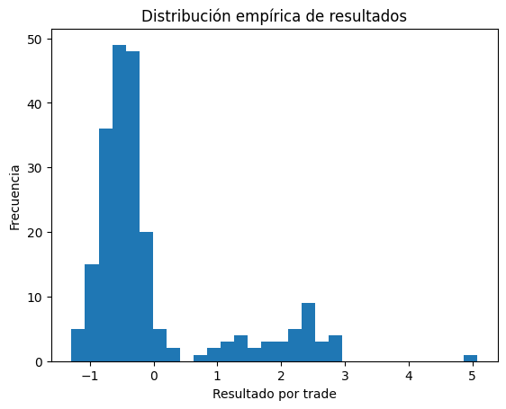

# Distribuciones empíricas
**Cuando el paisaje se construye con datos reales**

## Introducción

Hasta ahora hablamos de distribuciones como idea: un paisaje donde habita una variable aleatoria.

En trading cuando usamos la palabra **empírica** nos referimos a **lo observado**, osea una **distribución empírica** es la distribucion que se forma con los datos registrados.

Una distribución empírica es el comportamiento que una variable **mostró efectivamente** en los datos que tenemos. No surge de una fórmula. Surge de observar muchas veces el mismo fenómeno y registrar qué valores aparecen y con qué frecuencia.

Es importante resaltar una distinción: una **distribución empírica** no es la distribución en sentido pleno, es una **estimación** de la distribución, construida a partir de observaciones pasadas y con información limitada.

Si intentamos usar la distribucion empirica para pensar el futuro, aparecen supuestos:
* Estamos viendo el fenóneno con informacion limitada.
* Lo observado pertenece a un contexto específico.
* El comportamiento futuro podria ser parecerse al comportamiento pasado.

Una distribución empírica puede construirse a partir de: los rendimientos de una estrategia, los resultados de cada operación, los drawdowns observados, la duración de las operaciones, la volatilidad diaria de un activo, etc.

## Por qué las distribuciones empíricas son importantes en trading

Primero miramos **qué hacen los datos** , después, si hace falta, pensamos en modelos.

La distribución empírica es fundamental porque tiene tres virtudes fundamentales:

1. No necesita suposiciones.
2. Está anclada en la realidad del sistema.
3. Muestra tanto lo esperado como lo no esperado.

Por eso se convierte en el punto de partida de cualquier análisis cuantitativo serio. Antes de decidir, antes de validar, antes de modelar, hay que mirar qué ocurrió realmente.

## El tamaño de la muestra importa

Cuando trabajamos con pocas observaciones, el paisaje está incompleto. Algunas zonas aparecen bien definidas: los resultados frecuentes, los comportamientos típicos. Otras quedan mal exploradas: los eventos raros, las pérdidas extremas, los drawdowns profundos.

Esto no es un defecto del enfoque empírico. Es una consecuencia inevitable de trabajar con datos reales.

En trading, muchas veces las colas todavía no aparecieron. Y que no hayan aparecido no significa que no existan. La distribución empírica muestra lo que ya pasó, no todo lo que puede pasar.

## Ejemplo

Una estrategia genera una secuencia de resultados. Cada operación termina con una ganancia o una pérdida, de distinta magnitud.

No sabemos si la estrategia es “buena” o “mala”.
No sabemos si va a funcionar mañana.
Solo sabemos **qué resultados produjo hasta ahora**.

Eso es todo lo que necesitamos para construir una distribución empírica.

Si tomamos esos resultados y los graficamos en un histograma, aparece un paisaje irregular, con zonas más pobladas y otras casi vacías. Ese paisaje **es la distribución empírica de la estrategia**.

Estamos viendo **frecuencias observadas**.

El gráfico responde preguntas fundamentales:

* ¿Dónde se concentran la mayoría de los resultados?
* ¿Qué tan grandes son las pérdidas habituales?
* ¿Existen eventos extremos?
* ¿La distribución es simétrica o está inclinada hacia un lado?

Antes de cualquier cálculo adicional, ese paisaje ya dice mucho más que una media aislada.

Este histograma no lo miramos para decidir si “se parece” a una normal, lo miramos para entender **cómo se reparte el comportamiento observado**.

En un solo vistazo aparecen varias cosas: una zona central donde ocurren la mayoría de los trades, una asimetría clara entre pérdidas frecuentes y ganancias menos frecuentes, una cola que se extiende hacia resultados grandes, que pueden ser pocos pero relevantes.

Nada de esto surge de una fórmula, todo surge de **lo que efectivamente pasó**. Ese es el valor de una distribución empírica: convertir una lista de resultados en un paisaje que puede pensarse.

## Distribuciones empíricas y contexto

Una misma estrategia puede tener **distintas distribuciones empíricas** según el contexto:

* Mercado tendencial vs lateral
* Volatilidad alta vs baja
* Antes y después de una noticia
* Distintos activos

El sistema es el mismo, la variable es la misma, pero el paisaje cambia. Por eso, hablar de **la distribución de una estrategia** sin mencionar el contexto es incompleto.

Una distribución empírica siempre debe leerse como: “Esta es la distribución **bajo estas condiciones**.”

## Distribución empírica vs modelo teórico

Más adelante aparecerán distribuciones teóricas: normal, binomial, Poisson, etc. Cuando lleguemos ahí, la pregunta no será:

¿Qué distribución es esta?

Sino:

¿Qué modelo podría aproximar este comportamiento, y con qué error?

La distribución empírica es el punto de referencia. El modelo, si aparece, es una simplificación con error.

