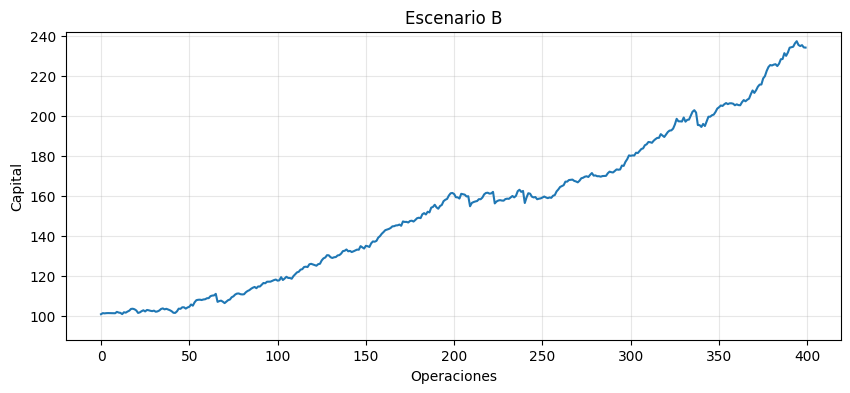
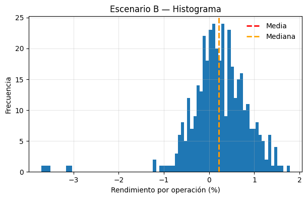

# Estrategia B: Una versión operable

En la estrategia del punto anterior observamos un **drawdown muy agresivo**, que obliga a permanecer operando **más de 150 operaciones** (lo que en la práctica pueden ser **varios meses**) por debajo del máximo histórico alcanzado.

Esa condición no es solo un dato técnico: es una carga psicológica importante. Operar durante tanto tiempo en pérdida no es una situación cómoda ni natural para una persona real. Aparecen dudas, tensión, cansancio y la tentación constante de abandonar la estrategia justo en el peor momento.

Pero ese drawdown no aparece por casualidad, es la consecuencia directa de la **forma de la distribución de resultados** de la estrategia A.

Al analizar sus rendimientos operación por operación vimos que la estrategia presentaba una **cola izquierda larga y profunda**: ganancias frecuentes pero pequeñas, y pérdidas poco frecuentes pero muy grandes. Esa asimetría negativa explica por qué unos pocos eventos extremos son capaces de borrar meses completos de trabajo.

Por este motivo decidimos **reformular la estrategia**. A esta nueva versión la llamamos **estrategia B**.

El objetivo de esta reformulación **no es hacerla más rentable**, sino hacerla **más operable**. Es decir, aceptar sacrificar parte del rendimiento esperado a cambio de **modificar la forma de la distribución**, suavizando la cola izquierda y reduciendo el impacto de los eventos extremos.

Revisamos entonces el gráfico de drawdown de la estrategia B:

A simple vista se observa una diferencia importante: Las caídas son **menos profundas** y **menos prolongadas**. La estrategia entra en pérdida, pero lo hace de una forma más controlada y con recuperaciones más rápidas. Esto cambia por completo la experiencia de operación.

Luego observamos la curva de crecimiento del capital:

El crecimiento ahora es **más lento**. La pendiente de la curva es menor y no genera entusiasmo inmediato. Sin embargo, también desaparecen las caídas abruptas. La curva es más estable, más predecible, casi aburrida. Y eso no es un defecto, es exactamente lo que estábamos buscando.

La estrategia B **no es mejor que la estrategia A en términos de rendimiento**, pero sí es mejor en un aspecto fundamental: **puede ser operada por una persona real**.

Gana menos, pero su forma es más amigable.\
Y en trading, muchas veces **la forma de la distribución importa más que la media**.

Al observar el histograma de rendimientos de la **estrategia B** se nota inmediatamente un cambio en la **forma de la distribución**.

La mayor parte de las operaciones se concentra cerca del centro, y la cola izquierda sigue existiendo, pero es **mucho menos profunda**. Los eventos negativos extremos no desaparecen, pero su magnitud es claramente menor que en la estrategia anterior.

Esto tiene varias implicancias importantes:

* La **media y la mediana** aparecen más cercanas entre sí, señal de una distribución más equilibrada.

* La **dispersión** es menor: los resultados extremos están más contenidos.

* La **cola izquierda es más corta**, lo que reduce la probabilidad de pérdidas que destruyan meses de trabajo en una sola operación.

La estrategia B no elimina el riesgo, pero **cambia su forma**. Y al cambiar la forma de la distribución, cambia también la experiencia de operarla.

***

## Comparación de estrategias A y B

Al comparar los histogramas de la **estrategia A** y la **estrategia B**, queda claro que el cambio principal no está en el centro de la distribución, sino en sus extremos.

La estrategia A presenta una **cola izquierda larga y profunda**: pocas operaciones negativas concentran pérdidas muy grandes, capaces de borrar meses completos de ganancias. La estrategia B, en cambio, mantiene una cola izquierda **más corta y contenida**. Sigue perdiendo, pero las pérdidas extremas son menos dañinas.

Este contraste deja una idea clave:

**No estamos optimizando solo la media. Estamos optimizando la forma de la distribución, en particular la cola izquierda.**

Reducir la agresividad de esa cola no hace a la estrategia “mejor” en términos de rendimiento máximo, pero sí la hace **más operable**, más sostenible y más compatible con una persona real que debe convivir con pérdidas, dudas y tiempo.

En trading, muchas veces **sobrevivir mejor importa más que ganar más**.

**¿La cola que vemos es toda la cola, o solo una parte?**

Con pocas observaciones, los eventos extremos aparecen poco. Eso no significa que no existan eventos más grandes, sino que **todavía no los vimos**.

En mercados financieros, las colas suelen ser más largas de lo que sugieren las muestras pequeñas. Por eso, cuando observamos pérdidas extremas aisladas, no conviene pensar: “esto ya pasó”, sino más bien:
“esto es una señal de lo que puede volver a pasar”.

Más adelante veremos herramientas para **explorar y tensionar la cola** aun con pocos datos (simulación, bootstrap, escenarios). Por ahora, la lección es conceptual:

**Si una estrategia ya mostró eventos extremos grandes, hay que asumir que su cola existe… aunque todavía no la hayamos visto completa.**

