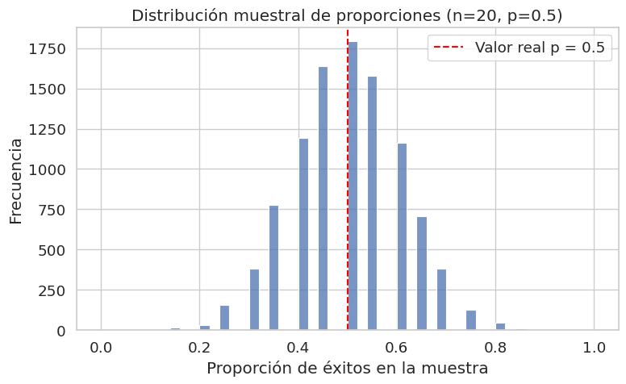

# ¿Estoy mejorando o solo tuve suerte? (caso 1)

En este primer caso vamos a ver cómo la estadística puede ayudarte a responder una pregunta clave en trading: ¿mi rendimiento mejoró, o solo tuve suerte?

Durante las últimas 4 semanas, tu tasa de acierto subió al 75%, cuando normalmente rondaba el 50%. Sentís que ves el mercado con más claridad, que lo estás entendiendo mejor. Pero también te aparece una duda:

**¿Y si simplemente tuve suerte?**

Querés saber si ese rendimiento reciente se debe realmente a una mejora en tu lectura del mercado, o si simplemente tuviste una buena racha. Lo que buscás, en el fondo, es una forma de evaluar si esta mejora es **real** o si podría haber ocurrido por azar.

### Formulando la pregunta

Querés comparar tu tasa de acierto reciente (75%) con tu tasa de acierto histórica (50%). Tenés datos de 100 operaciones pasadas y 20 operaciones recientes. Y te hacés la siguiente pregunta:

**¿Es normal tener una racha buena como esta sin haber cambiado nada, o realmente estoy operando mejor?**

### Tenemos dos grupos de operaciones:

1. ** Operaciones anteriores a la mejora**: un grupo de 100 operaciones que tienen una tasa de acierto del 50%
2. **Operaciones recientes**: un grupo de operaciones recientes con una tasa de acierto del 75%

Has categorizado cada operación realizada como ganadora o perdedora de la siguiente manera:

| Operación | Resultado |
| --------- | --------- |
| 1         | Ganadora  |
| 2         | Perdedora |
| 3         | Perdedora |
| 4         | Perdedora |
| ...       | ...       |
| 100       | Ganadora  |

| Operación | Resultado |
| --------- | --------- |
| 1         | Ganadora  |
| 2         | Perdedora |
| ...       | ...       |
| 20        | Ganadora  |

La siguiente tabla resume los datos de las tablas anteriores:

|            | Ganadoras | Perdedoras |
| ---------- | --------- | ---------- |
| Anteriores | 50        | 50         |
| Recientes  | 15        | 5          |

## ¿Qué es una proporción?

Una proporción es un número que representa cuántos éxitos hubo sobre el total de casos. Es como una tasa de acierto: ganadoras / total.

* Proporción de operaciones ganadoras anteriores = 50 / 100 = 0.5
* Proporción de operaciones ganadoras recientes = 15 / 20 = 0.75

Observando que las proporciones son distintas nos surgen algunas dudas:

**¿Existe una diferencia real entre los dos grupos de operaciones o es solo un efecto del azar?**

Podría ser que esta mejora en la tasa de acierto sea solo una buena racha, y que a medida que hagas más operaciones, la proporción vuelva a acercarse al 50%. Pero... ¿y si no es una racha? ¿Y si realmente estás operando mejor? La diferencia (de un 50% a un 75%) es suficientemente grande como para ser poco creíble como una consecuencia del azar. Por lo tanto estaríamos realizándonos la siguiente pregunta:

**¿La diferencia que observás se explica por azar o existe evidencia de que realmente estás operando mejor?**

## Una proporción es una media

En realidad, podemos pensar cada operación como un número:

* 1 si fue ganadora
* 0 si fue perdedora

La proporción de éxitos es simplemente la **media de esos ceros y unos**.

Entonces, al decir que tu tasa de acierto fue del 75%, estás diciendo que la **media muestral** de tus resultados fue 0.75. Y si antes era 0.50, eso implica que **el promedio cambió**.

Este promedio observado en la muestra es lo que llamamos:

### Estimador puntual

Un **estimador puntual** es un número que usamos para estimar un parámetro desconocido de la población a través de una muestra. En este caso:

* **Parámetro poblacional**: la probabilidad real de que una operación sea ganadora.
* **Estimador puntual**: la proporción observada en la muestra.

### ¿Y el parámetro real?

El parámetro verdadero (la tasa real de aciertos si hicieras infinitas operaciones) **no lo vas a conocer nunca** porque siempre trabajamos con muestras. Pero ese parámetro —aunque desconocido— tiene sus propias reglas.

En este caso, lo que te interesa (la tasa real de acierto) se llama **parámetro poblacional**, y aunque no sepamos su valor exacto, **podemos asignarle una distribución de probabilidad**: una manera de representar cuán probable es que tome ciertos valores.

La estadística se encarga de inferir, a partir de la muestra, qué valores del parámetro son más o menos plausibles. Pero siempre desde la incertidumbre.

## ¿Cuánto puede variar una proporción?

Aunque tu probabilidad real de éxito no cambie, si hacés solo unas pocas operaciones, la proporción observada puede variar. Esa variabilidad no implica que cambió tu capacidad: es solo **variabilidad muestral**.

Y esa variabilidad se puede **medir**.

### Varianza y desviación muestral para una proporción

Si cada resultado es 0 (pérdida) o 1 (ganancia), la varianza muestral se puede estimar como:

$S_p = \frac {p * (1 - p)}{n}$

La desviación muestral será la raíz cuadrada de la varianza:

$\sigma_s = \sqrt {S_p}$

Donde:

* $p$: es la proporción observada
* $n$: es el tamaño de la muestra
* $S_p$: es la varianza muestral
* $\sigma_s$: es la desviación muestral

Esto nos permite calcular una **medida de variabilidad** que puede tener la proporción por puro azar.

**Ejemplo:**

Para 20 operaciones con p = 0.75:

$S_p = 0.75 * 0.25 / 20 = 0.009375$
$\sigma_s = \sqrt {0.009375} = 0.097$

Es decir, incluso si tu tasa real fuera 75%, esperaríamos ver variaciones de unos ±10% arriba o abajo, solo por azar.

## Distribuciones, azar y expectativa

Detrás de esta variabilidad hay una idea fundamental:

### Las proporciones muestrales tienen una distribución de probabilidad

Si repitieras mil veces un experimento con 20 operaciones, y la probabilidad real fuera 50%, las proporciones observadas no serían siempre 0.50. Tendrías 0.45, 0.60, 0.35, 0.55...

**Esa variabilidad forma una distribución**. Y cuanto más grande sea la muestra, más concentrada estará esa distribución alrededor de la proporción real.

Podés imaginar esta distribución como un gráfico de barras o una curva de campana: más alta en el centro, más baja en los extremos. Eso nos lleva a un resultado fundamental de la estadística:

### Teorema Central del Límite (TCL)

El Teorema Central del Límite dice algo extraordinario:

Cuando tomamos muestras aleatorias suficientemente grandes, la distribución de sus medias (o proporciones) **tiende a parecerse a una distribución normal**, sin importar la forma de la distribución original.

Es decir:

* Aunque la variable original sea binaria (ganás o perdés),
* Aunque la distribución poblacional no sea normal,
* Si la muestra es suficientemente grande,
* Entonces la **distribución de la media muestral** (o la proporción muestral) se parecerá a una campana de Gauss.

Y eso nos va a permitir, en la próxima ficha, construir **intervalos de confianza** y realizar **test de hipótesis**.

La siguiente figura muestra la distribución de proporciones obtenidas en 10.000 muestras simuladas de tamaño 20, con una probabilidad real de éxito de 0.5.

A pesar de que cada muestra tiene solo 20 operaciones (con resultados 0 o 1), la distribución de proporciones forma una curva **centrada en 0.5** y con forma bastante **simétrica**. Es un ejemplo visual del **Teorema Central del Límite** en acción:

## Notas conceptuales

* **Proporción muestral**: número que representa la tasa de éxitos sobre el total de casos observados.
* **Estimador puntual**: valor de una estadística calculada sobre la muestra que estimamos representa a la población.
* **Parámetro poblacional**: valor real (y desconocido) que queremos estimar. Tiene su propia distribución teórica.
* **Varianza de una proporción**: se calcula como p(1 - p)/n, y mide cuánta variabilidad podemos esperar por azar.
* **Distribución de muestreo**: conjunto de valores que puede tomar un estimador (como la proporción) si repitiéramos el experimento muchas veces.
* **Teorema Central del Límite**: establece que, bajo ciertas condiciones, la distribución de la media muestral (o proporción) tiende a una normal, aun si la variable original no lo es.

---

En la próxima ficha vamos a usar todo esto para construir un **intervalo de confianza para tu tasa de acierto**, y para **evaluar si tu mejora reciente es estadísticamente creíble o no**.
