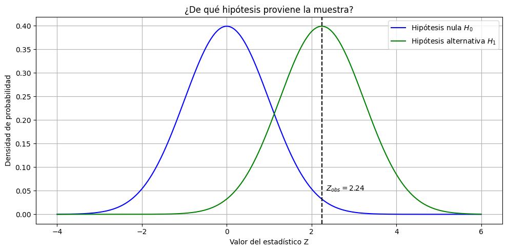
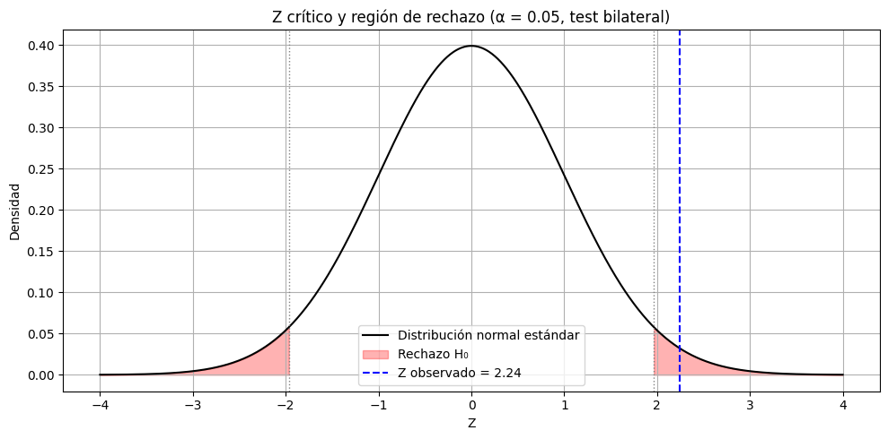

# ¿Es esta mejora estadísticamente creíble? (parte 2)

En la ficha anterior analizamos tu tasa de acierto reciente del 75% comparada con un histórico del 50%. Calculamos la proporción, la varianza muestral y visualizamos su distribución esperada por azar. Ahora vamos a dar un paso más: construir un **intervalo de confianza** y realizar un **test de hipótesis** para evaluar si esa mejora puede considerarse estadísticamente significativa.

## ¿Qué tan confiado puedo estar de que estoy mejorando?

La pregunta que te hacés es razonable: ¿esa diferencia del 25% se debe a una mejora real, o puede explicarse por azar? Para responder, vamos a estimar **un rango de valores plausibles para tu tasa real de aciertos**. Ese rango se llama:

## Intervalo de confianza para una proporción

Si hacés un experimento aleatorio muchas veces (por ejemplo, 20 operaciones) y calculás la proporción cada vez, vas a obtener diferentes resultados. Pero esos resultados no están desperdigados al azar: tienen una distribución.

Esa distribución que describimos se llama **distribución muestral**. Y cuando el tamaño de muestra es suficientemente grande, esa distribución **tiende a ser una distribución normal**, gracias al **Teorema Central del Límite**.

Por eso podemos usar una curva normal para estimar qué valores de la proporción muestral serían más o menos probables si repitiéramos este experimento muchas veces.

Lo que queremos es usar esa distribución para construir un rango alrededor del valor observado que nos diga:

**Si la proporción real fuera esta, entonces es razonable obtener una muestra como la que tuviste.**

Ese rango se llama **intervalo de confianza**, y se interpreta así:

Un intervalo de confianza del 95% es un intervalo que abarca el 95% de los valores más comunes que puede tomar una proporción muestral. Es decir, deja fuera solamente los valores más extremos (5%), los menos probables.

La fórmula que se suele usar para aproximar ese intervalo es:

$IC_{95\%} = \hat{p} \pm Z * \sqrt{\frac{\hat{p}(1 - \hat{p})}{n}}$

Donde:

* $\hat{p}$ es la proporción observada (en este caso 0.75)

* $n$: es el tamaño de la muestra (20)

* $Z$: es el valor crítico de la distribución normal para el nivel de confianza deseado (1.96 para 95%)

### Cálculo:

$Error\  Estándar = \sqrt{0.75 * 0.25 / 20} = 0.097$

$IC_{95\%} = 0.75 \pm 1.96 * 0.097 = (0.56 ; 0.94)$

**Interpretación**: Si repitieras muchas veces este tipo de observación, en el 95% de los casos el valor real de tu tasa de acierto estaría dentro de ese intervalo.

Pero esto no basta. ¿Qué pasa si el 50% también está dentro del intervalo? ¿Qué hacemos con esa posibilidad?

Ahí es donde entra el siguiente tema.

## Test de hipótesis para una proporción (bidireccional)

Ya tenemos un intervalo de confianza del 95% para nuestra proporción. Si el valor hipotético $p = 0.5$ **queda fuera** de ese intervalo, entonces podemos decir que es poco creíble que esa sea la proporción real.

**Esa es una forma válida de hacer un test de hipótesis.**

El intervalo nos da una región de valores compatibles con la muestra. Si lo que plantea la hipótesis nula queda **por fuera**, entonces esa hipótesis **no se sostiene frente a los datos**.

### Test de hipótesis como un problema de pertenencia

Otra forma de entender el test de hipótesis es pensar que las hipótesis representan posibles poblaciones desde donde pueden provenir las muestras.

Una **hipótesis estadística** es suponer que nuestra muestra pertenece a una determinada población. Y como no podemos observar la población entera, lo que hacemos es **plantear una hipótesis inicial con la intención de rechazarla**. A esa hipótesis la llamamos **hipótesis nula ($H_0$)**.

Rechazar $H_0$ significa que hay evidencia para creer que la muestra **no proviene de esa población**, y por lo tanto **aceptamos una hipótesis alternativa ($H_1$)** que plantea una diferencia significativa.

Cuando obtenés una muestra (como la tuya con 75%), lo que hacés es preguntarte:

**¿Es razonable que una muestra como esta haya salido de la población de H₀?**

Si la respuesta es “sí, es razonable”, no tenemos motivos para rechazar H₀.\
Si la respuesta es “no, es muy poco probable”, entonces sí, tenemos evidencia para decir que estamos en otra población.

Y eso lo evaluamos calculando **cuán lejos** está la muestra observada del valor central de H₀.

### Hipótesis:

* $H_0$ (hipótesis nula): $p = 0.5$ (no hubo mejora)
* $H_1$ (hipótesis alternativa): $p \neq 0.5$ (hubo un cambio)

Este es un **test bilateral**, porque no estás preguntando si mejoraste específicamente, sino si cambió significativamente.

Si planteamos la hipótesis alternativa como si aumento o disminuyo, estariamos realizando un **test unilateral**:

$H_0$: $p = 0.5$
$H_1: p > 0.5$ (unilateral derecho)

$H_0$: $p = 0.5$
$H_1: p < 0.5$ (unilateral izquierdo)

### Pasos para realizar el test de hipótesis

1. **Establecer las hipótesis:**

$H_0$: $p = 0.5$
$H_1: p \neq 0.5$ (bilateral)

2. **Elegir el nivel de significación**: $\alpha$

Este valor representa el nivel de tolerancia que tenés al riesgo de rechazar $H_0$ cuando en realidad es cierta. Es decir, es la probabilidad de cometer un **error tipo I**, este error lo veremos en la siguiente ficha.

Para el test clásico se usa $\alpha = 0.05$, lo que significa que estás dispuesto a asumir un 5% de probabilidad de tomar una decisión incorrecta en ese sentido.

Este nivel de significación también define el **valor crítico** (por ejemplo, $Z = \pm 1.96$ para $\alpha = 0.05$ en un test bilateral)

3. **Obtener el valor crítico ($Z_c$)**

  El valor crítico depende del tipo de test y del nivel de significación ($\alpha$). Este valor define los umbrales a partir de los cuales los resultados se consideran demasiado extremos como para seguir creyendo en $H_0$.

  * En un **test bilateral**, el área total de $\alpha$ se reparte en ambas colas de la distribución normal.

  * En un **test unilateral**, todo $\alpha$ se ubica en una sola cola (izquierda o derecha, según el caso).

  Las siguientes tablas muestran los valores críticos más comunes:

  **Test bilateral**

| Nivel de significación ($\alpha$) |	Z crítico ($\pm Z_c$) |
|-----------------------|---------------|
| 0.10 | ±1.645 |
| 0.05 | ±1.960 |
| 0.01 | ±2.576 |

**Test unilateral** (cola derecha o izquierda)

| Nivel de significación ($\alpha$) | Z crítico ($Z_c$) |
|----------------------|-------------|
| 0.10 | 1.282 |
| 0.05 | 1.645 |
| 0.01 | 2.326 |

En nuestro caso (test bilateral con $\alpha = 0.05$), se utiliza $Z_c = \pm 1.96$.

Zona de aceptación: entre −1.96 y +1.96
Zona de rechazo: fuera de ese intervalo (valores extremos a izquierda o derecha)

Si el valor de $Z$ calculado cae en la zona de rechazo, consideramos que es poco probable que provenga de $H_0$ y por eso rechazamos la hipótesis nula.

4. **Calcular el estadístico para la muestra y compararlo con la región crítica.**

Se usa la siguiente fórmula para una proporción:

$Z = \frac{\hat{p} - p}{\sqrt{p * (1 - p) / n}}$

* Donde:

  * $\hat{p}$ es la proporción observada en la muestra

  * $p$ es el valor bajo $H\_0$

  * $n$ es el tamaño de la muestra

### Ejemplo:

* $\hat{p} = 0.75$
* $p = 0.5$
* $n = 20$

Cálculo:

$Z = \frac{0.75 - 0.5}{\sqrt{0.5 * 0.5 / 20}} = 2.24$

### ¿Qué significa ese Z?

El estadístico que calculamos es $Z = 2.24$. Como estamos haciendo un test bilateral con $\alpha = 0.05$, el valor crítico es $Z\_c = \pm 1.96$.

### Regla de decisión:

* Si $Z$ está **entre** $−1.96$ y $+1.96$, **no rechazamos** $H_0$ (zona de aceptación).

* Si $Z < −1.96$ o $Z > +1.96$, **rechazamos** $H\_0$ (zona de rechazo).

Como Z=2.24 se encuentra fuera del intervalo aceptable (−1.96,+1.96), concluimos que los datos observados **no son consistentes con la hipótesis nula**. Rechazamos $H_0$​.

### Conclusión:

**Rechazamos la hipótesis nula.** Hay evidencia estadística suficiente para decir que tu tasa de acierto reciente no es compatible con una proporción del 50%. Algo cambió.

Esto no prueba que estés operando mejor, pero **sí** sugiere que tus resultados recientes **no se explican fácilmente por el azar**, si es que el 50% fuera todavía tu tasa real.

## Notas conceptuales

* **Distribución muestral**: la distribución que tendría un estimador (como una proporción) si repitiéramos el experimento muchas veces.

* **Intervalo de confianza**: rango de valores que contiene, con cierta confianza (por ejemplo 95%), los valores más probables del estimador.

* **Hipótesis nula**: afirmación que se pone a prueba. Generalmente representa la ausencia de efecto o cambio.

* **Test bidireccional**: evalúa si el valor observado es significativamente distinto (ya sea mayor o menor).

* **Estadístico Z**: medida estandarizada de cuán lejos está tu valor observado de lo que se espera bajo $H\_0$.

* **Valor crítico**: umbral que define la región de rechazo de la hipótesis.

* **Teorema Central del Límite**: asegura que, bajo ciertas condiciones, la distribución muestral de la media (o proporción) se aproxima a una normal.

***

En la próxima ficha, vamos a profundizar en los posibles errores al tomar esta decisión y cómo se interpreta realmente el “nivel de significación”.

