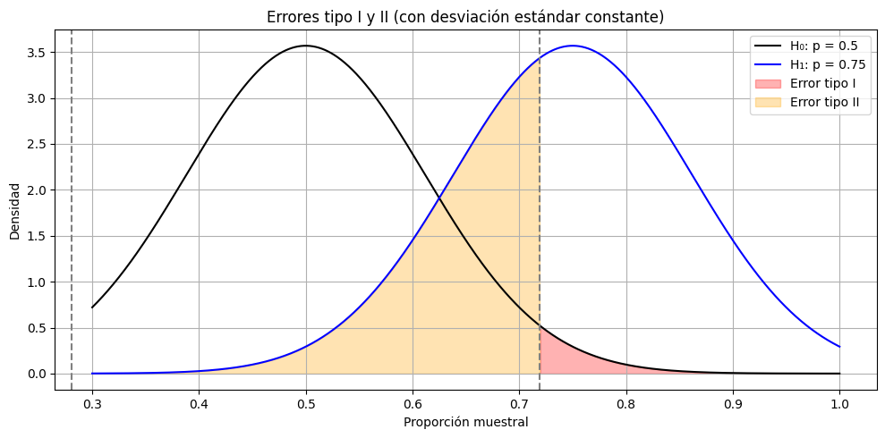

# ¿Estoy mejorando o solo tuve suerte? (parte 3)
**Errores tipo I y II**

En la ficha anterior tomamos una decisión basada en evidencia: **rechazamos la hipótesis nula** porque la proporción del 75% era demasiado extrema como para explicarla por azar, si la proporción real fuera 50%.

Pero incluso cuando hacemos las cosas bien, **podemos equivocarnos**.

Y esa posibilidad no es un error técnico ni una falla humana. Es parte de la naturaleza de tomar decisiones en condiciones de incertidumbre.

## ¿Qué significa tomar una decisión estadística?

Cuando hacemos un test de hipótesis, tomamos una decisión entre dos opciones:

* **Aceptar H₀**: creer que los datos provienen de la población que plantea la hipótesis nula.
* **Rechazar H₀**: creer que los datos no provienen de esa población y que algo cambió.

Pero como no vemos la población entera, esa decisión puede ser **correcta o incorrecta**. Y según lo que decidimos y lo que realmente era cierto, pueden ocurrir distintos escenarios:

| Decisión \ Realidad | H₀ es verdadera     | H₀ es falsa         |
| ------------------- | ------------------- | ------------------- |
| **No rechazar H₀**  | ✅ Decisión correcta | ❌ Error tipo II     |
| **Rechazar H₀**     | ❌ Error tipo I      | ✅ Decisión correcta |

## Error tipo I: falso positivo

Sucede cuando **rechazamos H₀ siendo que era cierta**. O sea, creemos que algo cambió cuando en realidad no cambió nada.

Es como pensar que estás operando mejor cuando en realidad fue solo una racha de suerte. Este es el error que tratamos de controlar con el nivel de significancia $\alpha$.

## Error tipo II: falso negativo

Ocurre cuando **no rechazamos H₀ siendo que era falsa**. Es decir, no detectamos un cambio real porque la muestra que obtuvimos no fue lo suficientemente extrema.

Es como seguir creyendo que estás operando igual que siempre, cuando en realidad sí hubo una mejora.

## Visualizando los errores

Vamos a mostrar una imagen con dos curvas:

* La curva bajo $H_0$, centrada en  $p = 0.5$.
* La curva bajo $H_1$, centrada en $p = 0.75$.

**Y vamos a sombrear:**

* La **zona de rechazo** bajo $H_0$ (error tipo I si estábamos en $H_0$).
* La **zona de aceptación** bajo $H_0$, pero desde el punto de vista de $H_1$ (error tipo II si estábamos en $H_1$).

## ¿Podemos evitar estos errores?

No completamente. Pero podemos:

* **Controlar el error tipo I**: eligiendo un $alpha$ más bajo (como 0.01 en lugar de 0.05).
* **Reducir el error tipo II**: aumentando el **tamaño de la muestra (n)**.

Hay una **tensión natural** entre ambos errores. Si hacés más exigente el test para evitar el error tipo I, aumentás la probabilidad de cometer el tipo II.

Por eso, la estadística no da certezas absolutas. Lo que sí ofrece es una forma **rigurosa y cuantificada** de lidiar con la incertidumbre.

---

## Cierre del caso 1: ¿qué aprendimos como trader?

Volvamos al punto de partida. Tenías una intuición: “creo que estoy mejorando”. Pero no sabías si eso era una percepción subjetiva o una mejora real.

Aplicando estadística:

* Usaste la proporción de aciertos como un dato objetivo.

* Evaluaste si esa proporción era compatible con el pasado.

* Calculaste un intervalo de confianza.

* Realizaste un test de hipótesis.

* Reflexionaste sobre posibles errores.

Y llegaste a una conclusión fundamentada:

**Tus resultados recientes son difíciles de explicar por azar. Hay evidencia de que algo cambió.**

Eso no garantiza que estés en una nueva etapa de tu trading, pero te da una base sólida para seguir observando, midiendo y aprendiendo. Y ese es, probablemente, el cambio más importante de todos: dejaste de operar solo con intuición, y empezaste a combinarla con herramientas que te permiten pensar con más claridad.
