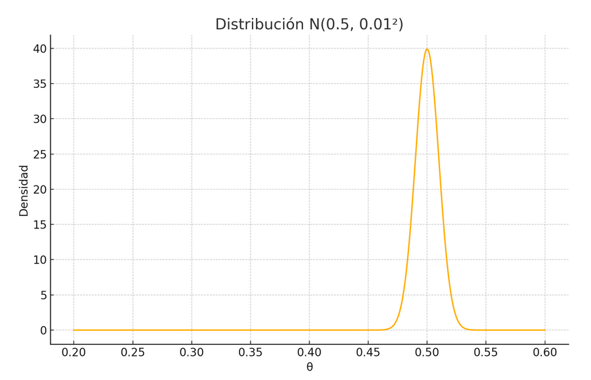
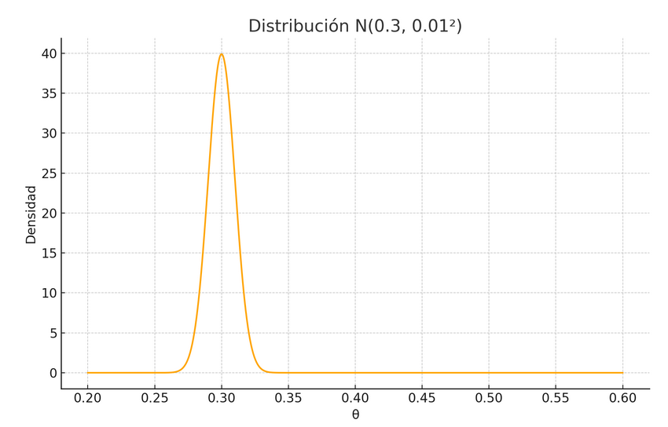
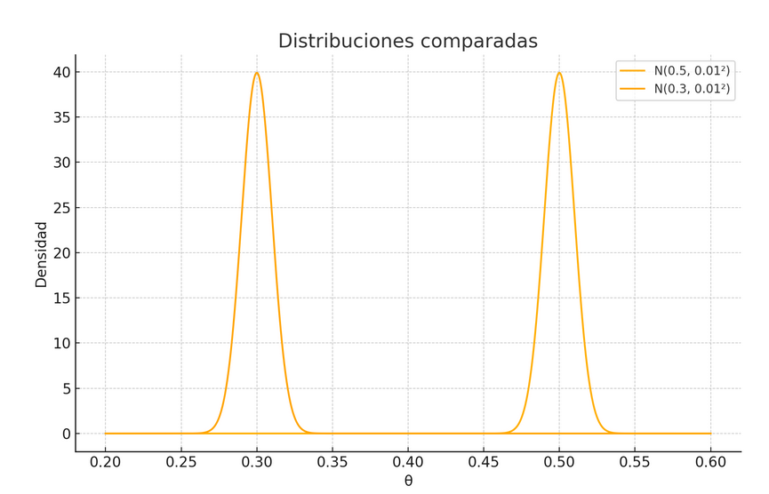

# 1. Bayes para traders
**"Cómo dejar de pensar en fijo"**

### Introducción

En la estadística clásica, solemos representar las probabilidades como **números fijos**. Por ejemplo, podríamos decir que “la probabilidad de que el índice suba mañana es 0.50”. Pero la realidad es que **no conocemos ese número con certeza**. Podemos tener una intuición, una creencia, una idea basada en el pasado, pero hay un montón de factores imprevisibles que pueden influir y modificar esta probabilidad.

Entonces, pensar la probabilidad como un número fijo es… bueno, **bastante simplificado**.

***

### ¿Y si en vez de un número fijo, usamos una variable aleatoria?

En lugar de decir:
“Mañana hay una probabilidad de 0.50 de que el índice suba”

…podemos decir:
“Mañana la probabilidad de que suba podría estar entre 40% y 60%”.

O mejor aún:
“No sé cuál es, pero tengo una **distribución de probabilidad** sobre eso.”

En vez de tener **un solo número**, tengo una **curva**.
Una función que dice: “la probabilidad de subida _podría estar por acá_… pero también _por allá_”.

***

### El salto conceptual

Eso que antes pensabas como un número fijo (ej: 0.5), ahora lo pensás como una **variable aleatoria continua entre 0 y 1**, con su propia función de densidad.

¿La compliqué mucho?
Esperá que lo veas en un gráfico y vas a entender todo.

Figura 1: Distribución priori P(θ)

***

### ¿Y para qué sirve todo esto?

Para **actualizar lo que creo** cuando aparecen nuevos datos.

#### Ejemplo simple:

Yo pensaba que había una probabilidad de 0.50 de que el índice suba mañana.

Pero hoy se publicaron datos económicos negativos.

Entonces, esa creencia **cambia**, ¿cómo cambia?

Ahora, mi nueva estimación podría ser: “hay una probabilidad de 0.30 de que suba”.

Figura 2: Distribución posteriori P(θ∣D)

### Pero... ¿cómo hago ese cambio de forma lógica?

Ahí entra Bayes.

La estadística bayesiana propone una forma distinta de pensar las probabilidades: en lugar de tratar una probabilidad como un número fijo (como en la estadística clásica), la representa como una **variable aleatoria con su propia distribución**.

Esto significa que **lo que creemos sobre un evento puede y debe actualizarse cuando aparece nueva información**. Bayes es el marco que permite hacer ese ajuste **de forma lógica, cuantificable y transparente**.

***

### Bayes en lenguaje de traders

Bayes te da una fórmula para **ajustar tu creencia previa cuando aparece nueva información**.

Así:

$P(\theta∣D) = \frac{P(D∣\theta) * P(\theta)}{P(D)}$​

**Que significa todo esto:**

* P(θ): lo que creías antes (la curva que decía que había una probabilidad de 0.5 de subir).

* P(D∣θ): cuán compatibles son **los datos nuevos** con tu hipótesis previa.

* P(D): la probabilidad total de ver esos datos, sin importar tu hipótesis.

* P(θ∣D): tu nueva creencia, distribución a posteriori **ajustada por la evidencia**.

Figura 3: Comparación de la distribuciones a priori y a posteriori

***

### Conclusión

Bayes no es magia.
Es una forma lógica y elegante de **cambiar de opinión con criterio**.
Es dejar de pensar en certezas y empezar a pensar en rangos, en curvas, en aprendizaje.
Y si lo entendés una vez, **ya no volvés atrás**.

Porque cuando tu mente aprende a razonar como Bayes…
te das cuenta de que ser un trader estadistico frecuencista ya no te sirve.

