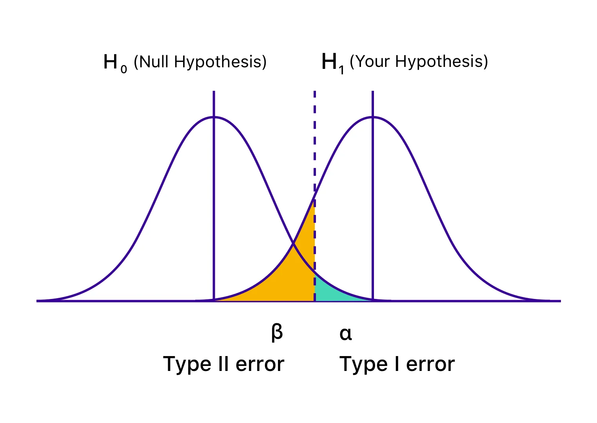

# Errores y potencia en una prueba de hipótesis  

## Introducción

Cuando tomás decisiones basadas en inferencia, sabés que hay dos formas de equivocarte:

- Podés actuar cuando no deberías (error tipo I)  
- Podés no actuar cuando deberías (error tipo II)

Ambos errores existen porque estás decidiendo con información incompleta.  
Pero también existen formas de **medir y reducir ese riesgo**.

Y eso nos lleva a un concepto clave: **la potencia estadística**.

---

## Los dos errores, uno frente al otro

Volvamos a la lógica del perro salvaje.  
Estás frente a un terreno.  
Hiciste observaciones y calculaste un intervalo.

Pero tenés que decidir: ¿pasás o no?

- Si avanzás, pero el perro *sí* llega: error tipo I  
- Si no avanzás, pero el perro *no* llega: error tipo II

No podés evitar completamente los errores.  
Pero sí podés **entender el riesgo que implica cada decisión**,  
y ajustar tus herramientas para ver mejor.

---

## Visualización con distribuciones

Para ver más claro este dilema, observá el siguiente gráfico:

- La **curva de la izquierda** muestra cómo se distribuirían las medias muestrales si la hipótesis nula ($H_0$) fuera verdadera.  
  Por ejemplo: que el rendimiento real de la estrategia sea exactamente cero.

- La **curva de la derecha** muestra cómo se distribuirían las medias si el rendimiento fuera positivo (hipótesis alternativa $H_1$).

No estamos diciendo que el parámetro $\mu$ tenga una distribución.  
En el enfoque clásico, $\mu$ es fijo pero desconocido.  
Lo que tiene distribución es **la media muestral**, porque cambia según la muestra que tomes.  
Eso lo sabemos gracias al **Teorema Central del Límite**.

---

## ¿Qué significan las áreas sombreadas?

Cuando hacés un test de hipótesis, trazás un umbral:  
si tu estadístico cae en cierta zona, **rechazás $H_0$**.

Eso genera dos tipos de errores:

- Si $H_0$ es verdadera, pero justo tu muestra cae en la zona de rechazo → **error tipo I**  
- Si $H_1$ es verdadera, pero tu muestra no se aleja lo suficiente de $H_0$ → **error tipo II**

El gráfico lo muestra así:

- La **zona verde** bajo $H_0$ es donde rechazás por error (tipo I)  
- La **zona naranja** bajo $H_1$ es donde no detectás el efecto real (tipo II)

---

## ¿Cómo se reduce el error tipo II y se gana potencia?

Fijate que las curvas están bastante superpuestas.  
Eso significa que hay muchas medias muestrales posibles que **podrían venir de cualquiera de los dos escenarios**.

La **potencia estadística** es la capacidad de tu test de **detectar una señal real cuando existe**.  
O en términos técnicos:

$$
\text{Potencia} = 1 - \beta
$$

Donde $\beta$ es la probabilidad de cometer un error tipo II.

Un test con alta potencia tiene **más chances de detectar efectos reales**  
y **menos riesgo de que se te escape algo que sí está pasando**.

---

## ¿Cómo se incrementa la potencia?

1. **Aumentando el tamaño de la muestra ($n$)**  
   Al crecer la muestra, las curvas se vuelven más angostas.  
   ¿Por qué? Porque el error estándar disminuye: $\frac{\sigma}{\sqrt{n}}$  
   Así hay menos superposición entre $H_0$ y $H_1$.

2. **Reduciendo la variabilidad (σ), si está en tu control**  
   Datos más consistentes permiten ver mejor los efectos reales.

3. **Usando un test unilateral cuando tenés una dirección esperada**  
   Si solo te importa saber si la media es mayor que cierto valor,  
   enfocar el test en una sola cola aumenta la potencia.

4. **Aceptando un nivel de significancia un poco más alto (mayor α)**  
   Ser menos estricto (por ejemplo, usar 10% en lugar de 5%)  
   te da más potencia… a costa de más riesgo de falsos positivos.

---

## Ejemplo aplicado

Tenés una estrategia con rendimiento promedio de 0.8%.  
La variabilidad es alta, y tu muestra es de solo 50 días.  
El intervalo de confianza incluye el cero.

Decidís no usarla. Pero tal vez estás cometiendo un **error tipo II**.

¿Por qué? Porque tu test tenía **baja potencia**:  
no tenías suficiente información para distinguir entre señal real y ruido.

Con más datos, el intervalo se habría estrechado.  
Y tal vez el rendimiento sí era real.

---

## ¿Qué podés hacer para mejorar la potencia?

- **Reunir más datos** antes de decidir  
- **Reducir el ruido en las mediciones**, si es posible  
- **Usar un test más enfocado** (unilateral) si tenés una hipótesis direccional  
- **Ajustar el nivel de confianza según el contexto**

---

## Nota conceptual

La potencia no elimina los errores.  
Pero te ayuda a ver más claro.  
Te dice **cuán preparado estás para distinguir lo real de lo aleatorio**.

En estadística, como en la vida,  
el problema no es solo equivocarse.  
El problema es no darte cuenta de que no estás viendo.

Y a veces, para poder actuar,  
**ver es poder**.
