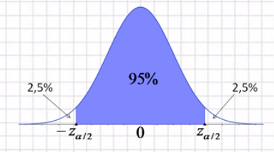
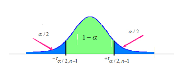

# Intervalo de confianza bilateral

## Introducción
Antes de hablar de fórmulas, vamos a observar una situación concreta.  
Porque muchas veces **la lógica de un concepto ya la vivimos**... solo que no con palabras estadísticas.

Esta historia sencilla te va a servir para anclar lo que viene:  
- Media muestral  
- Error típico  
- Intervalos de confianza  
- Test de hipótesis

## El caso del perro atado

Imaginemos a un perro feroz atado a un punto fijo con una cuerda. Nadie sabe con certeza donde esta atado ni cuán larga es la cuerda. Todos lo evitan por las dudas.

Lo observás desde lejos y cada día anotás hasta dónde llega cuando corre a ladrar.

Con esos datos:

- Calculás la **media muestral** → estimación del punto de anclaje  
- Calculás la **desviación típica** → cuán variable es su comportamiento  
- Y construís un **intervalo de confianza** → un rango alrededor de la media que representa el alcance probable de la fiera

## ¿Qué significa este intervalo?

- Si **estás dentro del intervalo**, existe riesgo: el perro *podría* alcanzarte.  
- Si **estás fuera**, es razonable suponer que estás a salvo… con cierto nivel de confianza.

Ese rango de precaución es lo que la estadística llama:
**Intervalo de confianza bilateral**

## Aplicación al análisis de estrategias

Ahora vamos al mercado.

Tenés una estrategia que arrojó una **media muestral de 0.21% diario** en una muestra de 100 días.  
Querés saber si esa estimación es confiable, o si fue solo ruido.

Usás un intervalo de confianza para estimar **el rango donde probablemente esté la media real**.

## Cuando conocés la desviación estándar poblacional (caso ideal)

$$
IC_{95} = \bar{x} \pm z_{\alpha/2} \cdot \frac{\sigma}{\sqrt{n}}
$$

Donde:  
- $\bar{x}$: media muestral  
- $z_{\alpha/2}$: valor crítico (1.96 para 95%)  
- $\sigma$: desviación estándar  
- $n$: tamaño de la muestra

## Pero en la práctica no conocemos $\sigma$

En la mayoría de los casos reales **no conocemos la desviación estándar poblacional**.  
Solo tenemos una muestra, y estimamos esa variabilidad con la **desviación muestral** ($s$).

Por eso, en lugar de usar la distribución normal, usamos la **distribución $t$ de Student**:

$$
IC = \bar{x} \pm t_{\alpha/2, n-1} \cdot \frac{s}{\sqrt{n}}
$$
La distribución $t$ se usa cuando trabajamos con muestras pequeñas o cuando no conocemos $\sigma$,  
porque ajusta el margen de error para compensar la mayor incertidumbre.
 
## Ejemplo práctico

- Media muestral: 0.21%  
- $n = 100$  
- $s = 1.6$  
- Nivel de confianza: 95% → $t_{0.025,\ 99} \approx 2.00$

$$
\text{Error típico} = 2.00 \cdot \frac{1.6}{\sqrt{100}} = 0.32
$$

$$
IC = 0.21 \pm 0.32 = (-0.11\%,\ 0.53\%)
$$

## Interpretación

- Como el intervalo **incluye el cero**, no tenés evidencia suficiente de que la estrategia sea rentable.
- Estás en la **zona de peligro**: el perro *podría* morderte.
- Para que la estrategia sera rentable, el intervalo de confianza no debe contener el cero.

## ¿Qué factores afectan el intervalo?

- **Mayor confianza** → intervalo más ancho (más precaución)
- **Mayor variabilidad** → más incertidumbre
- **Mayor tamaño de muestra** → intervalo más estrecho

## Nota conceptual

El intervalo de confianza **no te dice dónde está la media real**,  
te dice cuánto podés confiar en tu estimación.

Es como marcar una línea en el suelo:  
> “Desde acá, creo que el perro no me alcanza.”

Pero si el margen es muy amplio, mejor no pasar.

## Test de hipótesis con intervalo de confianza

Veamos ahora cómo decidir si una estrategia tiene retorno distinto de cero, usando directamente el intervalo de confianza.

### ¿Qué es un test de hipótesis?

Es un procedimiento para tomar decisiones con datos.

- **Hipótesis nula ($H_0$)**: no hay efecto (la media es 0)  
- **Hipótesis alternativa ($H_1$)**: hay un efecto (la media es distinta de 0)

- Construimos un intervalo de confianza
- Evaluamos si el valor de referencia está dentro
- Si está **fuera**, lo rechazás.  
- Si está **dentro**, no podés rechazarlo.

### Ejemplo con los datos anteriores:

$H_0$: $\mu=0$ (el rendimiento es nulo)
$H_1$: $\mu \neq 0$ (el rendimiento es distinto de cero)
Intervalo: $(-0.11\%,\ 0.53\%)$

Resultado: como **el 0 está dentro del intervalo**, **no podés rechazar la hipótesis nula**.
No hay evidencia estadística suficiente para afirmar que la estrategia genera retornos distintos de cero.

En la próxima ficha vamos a ver qué pasa cuando **solo te interesa un lado del riesgo**, como cuando querés saber si la estrategia **gana**, sin importar si pierde apenas.

