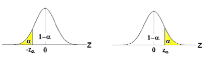
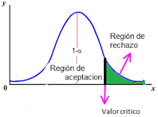

# Intervalo de confianza unilateral

## Introducción

En la ficha anterior estimamos el alcance de una fiera atada, usando un **intervalo bilateral**: nos importaban ambos lados del rango.

Pero a veces, **solo importa un lado del riesgo**.  
Por ejemplo, en trading:  
¿Puedo afirmar que esta estrategia tiene retorno positivo?

Ahí entra el **intervalo de confianza unilateral**.  
Y otra parte de nuestra historia…

## El caso del perro detrás del cerco

Veamos una segunda analogía, ahora no esta atadom pero esta detras de un cerco invisible, no podemos verlo pero existe.

Entonces lo observamos igual:

- ¿Hasta dónde llega?
- ¿Desde qué punto empieza a volverse riesgoso?

Queremos saber con confianza:  
¿Puedo pararme acá sin que me alcance?

## ¿Qué cambia respecto al caso anterior?

En el intervalo bilateral estimábamos **ambos extremos** de la media.
Ahora solo queremos saber si la media **es mayor (o menor)** que un valor.  

Ejemplo:  
¿Puedo afirmar que el rendimiento es mayor que cero?

## ¿Cómo se construye un intervalo unilateral?

Partimos de la misma fórmula, pero usamos **una sola cola** de la distribución:

### Para demostrar que la media es **mayor** que un valor (caso unilateral inferior):

$$
IC_{inferior} = \left(\bar{x} - t_{\alpha,\ n-1} \cdot \frac{s}{\sqrt{n}},\ \infty\right)
$$

Es decir, construimos un límite inferior.  
Si ese límite queda por encima del valor de referencia, hay evidencia suficiente.

## Ejemplo práctico

Queremos saber si una estrategia tiene retorno positivo.  
Datos:

- $\bar{x} = 0.26\%$  
- $n = 100$  
- $s = 1.6$  
- Nivel de confianza unilateral: 95%  
- $t_{0.05,\ 99} \approx 1.66$

### Cálculo:

$$
\text{Límite inferior} = 0.26 - 1.66 \cdot \frac{1.6}{\sqrt{100}} = 0.26 - 0.2656 = -0.0056
$$

$$
IC = (-0.0056,\ \infty)
$$

## Interpretación

Como el límite inferior está por debajo de cero,  
el valor de referencia (cero) queda dentro del intervalo.

Eso significa que no podés afirmar con confianza que la estrategia tenga un rendimiento positivo.  
Todavía podría estar dentro del margen del “no alcanza”.

## Test de hipótesis con intervalo unilateral

Un test de hipótesis es una herramienta para tomar decisiones estadísticas con cierto control del error.

En este caso:

- Hipótesis nula ($H_0$): la estrategia no gana o gana muy poco. $\mu \leq 0$  
- Hipótesis alternativa ($H_1$): la estrategia tiene retorno positivo. $\mu > 0$

Para hacer el test con intervalo:

- Si el valor de referencia (cero) **queda por fuera del intervalo**, podés rechazar $H_0$.  
- Si queda dentro del intervalo, no tenés evidencia suficiente para rechazarla.

Con los datos del ejemplo: el intervalo va de –0.0056 a infinito.  
Cero está dentro.  
Por lo tanto, no hay evidencia suficiente para afirmar que el rendimiento es mayor que cero.

Esta es la forma más visual, lógica y directa de hacer un test de hipótesis sin necesidad de p-valores.

## ¿Cuándo usar un intervalo unilateral?

Cuando desde el principio te importa solo un lado de la historia.  
Por ejemplo:

- Solo querés comprobar que una estrategia gana.

En estos casos, usás hipótesis direccionales:

- $H_0$: la media es menor o igual a cierto valor.  
- $H_1$: la media es mayor a ese valor.

O a la inversa, si te interesa demostrar que algo es menor.

También existe la versión inversa (intervalo superior), para hipótesis del tipo:  
- $H_0$: $\mu \geq x$  
- $H_1$: $\mu < x$

## Nota conceptual

El intervalo unilateral reduce la zona de incertidumbre,  
pero exige más claridad en el planteo inicial.

No sirve para explorar.  
Sirve para verificar si hay evidencia sólida en una dirección concreta.

## Cierre

Cuando solo te importa un lado del riesgo, el intervalo unilateral es tu herramienta.  
Te ayuda a saber si la ventaja es suficientemente clara como para avanzar,  
o si todavía estás en terreno dudoso.

Como en el caso del perro detrás del cerco:  
si no sabés si llega hasta vos, mejor no arriesgarte todavía.
