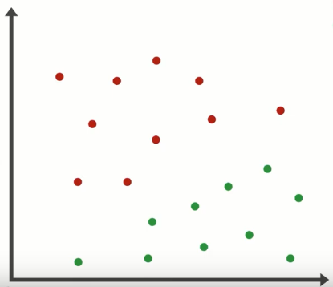

# Regresión logística binaria

La regresión logística es una técnica estadística esencial para modelar fenómenos donde el resultado es binario: éxito o fracaso, presencia o ausencia, sí o no. Si bien su nombre incluye "regresión", su objetivo principal es **clasificar** y **estimar probabilidades**, por eso también es ampliamente utilizada en machine learning como modelo de clasificación.

***

Explicaremos que es una regresión binaria a traves de un ejemplo, que no es una estrategia real, pero sirve para entender como se aplica en un contexto real.

Supongamos que estamos estudiando aperturas del mercado, y registramos para cada día:

* **Rango del primer minuto** (máximo - mínimo)

* **Dirección** (cierre - apertura)

* Y codificamos de forma binaria: **¿El precio subió al menos 5 puntos en los siguientes 10 minutos?**

    - Sí (éxito = 1)

    - No (fracaso = 0)

 Tendremos una tabla como la siguiente:
 
 | Rango | Dirección | Subió |
|-----------|--------------|---------|
| 1.5 | -1.2 | No|
| 2.6| 1.8 | Si |
|..... |..... |..... |

Graficamos y obtenemos:

 
 

### ¿Podemos encontrar una forma de separar los exitos de los fracasos?

A simple vista, parece que hay cierta zona donde se acumulan los verdes, y otra con más rojos.

Lo que queremos es **encontrar una línea**, una frontera, que nos diga:
    - Si las condiciones del setup están de este lado, probablemente sea un exito.
    - Si están del otro, probablemente sea un fracaso.

### ¿Cómo lo hacemos?

Podríamos intentar usar una recta como la siguiente:

$z(X) = b ​+w_1​* x_1 + w_2​ * x_2$
donde  $X = \{x_1, x_2, ..., x_n \}$

Esa recta nos devuelve un número que puede valer:

z = 0: sobre la recta
z > 0: arriba de la recta
z < 0: debajo de la recta

z∈(−∞,+∞)

Aunque z permite separar los puntos, **no  es una probabilidad**. Si queremos saber **con qué probabilidad un punto pertenece a la clase 1**, debemos transformar z con una función especial, llamada **función logística**.

***

## La función logística

Aplicamos una función que transforma cualquier número de z en un valor **entre 0 y 1**.
Ese valor ahora **sí podemos interpretarlo como una probabilidad**.
$$π(x)=\frac{1}{1+e^{-z(X)}}$$
Ahora el contorno no es un muro, sino una zona de inflexión donde la función logística transita gradualmente del exito al fracaso.

$\pi(x)$ representa la probabilidad de éxito dado un determinado estado (X)
$\pi(x) = P (éxito | X)$ donde  $X = \{x_1, x_2, ..., x_n \}$

Despejando de la ecuacion anterior:

$ln \frac {\pi(X)}{1 - \pi(X)} = z(X)$

### ¿Con qué probabilidad este setup tiene éxito, dadas sus condiciones técnicas?

Podemos imaginarlo así:

* Para valores de z muy negativos, la probabilidad π(x) se acerca a 0 entonces el modelo está casi seguro de que **es un fracaso**.

* Para valores de z muy positivos, π(x) se acerca a 1 entonces el modelo está convencido de que **es un éxito**.

* Para valores de z cercanos a 0, π(x) se acerca a 0.5  entonces el modelo está **indeciso**, estamos en la **zona de transición**.

Esa transición suave es una de las ventajas del modelo logístico: no clasifica de forma tajante, sino que asigna una **probabilidad**, lo que nos permite tomar decisiones más informadas según el nivel de certeza que exijamos.

***

## Clasificación con un umbral

Una vez que obtenemos π(x), es decir, la probabilidad estimada de que el precio suba, podemos usar un **umbral de decisión** para clasificar:

* Si π(x) > 0.5: clasificamos como **éxito** (el setup probablemente funciona).

* Si π(x) ≤ 0.5: clasificamos como **fracaso** (mejor evitarlo).

Este umbral no tiene que ser siempre 0.5. Podemos ajustarlo según el contexto:

* Si queremos minimizar riesgos, podemos exigir π(x)>0.7.

* Si preferimos capturar más oportunidades aunque algunas fallen, podríamos aceptar π(x)>0.4.

De esta manera, el modelo no solo **separa los datos**, sino que también nos informa **qué tan seguros podemos estar** al tomar una decisión basada en él.

***
## Interpretación de los coeficientes

Los valores w1​, w2​ y b (también llamados β1​, β2​, β0​) son los parámetros del modelo. Una vez entrenado, el modelo nos dice:

* Cuánto **influye el rango** (x₁) en la probabilidad de éxito.

* Cuánto **influye la dirección** (x₂).

* Y el término b ajusta el desplazamiento de la curva.

Cada coeficiente puede interpretarse así:

* Si $w_1$​ > 0, entonces cuanto mayor sea el rango del primer minuto, mayor será la probabilidad de éxito.

* Si $w_2$ ​< 0, entonces una dirección negativa reduce la probabilidad de éxito.

Estas interpretaciones nos ayudan a **comprender qué variables tienen más peso** en la decisión, y si el modelo está aprendiendo algo coherente con nuestra intuición o experiencia.

***
## Odds ratio

Antes de hablar de **odds ratio**, necesitamos entender primero qué son los **odds** (también llamadas *chances*).

### ¿Qué son los *odds*?

Los **odds** son una forma alternativa de expresar una probabilidad. En lugar de decir:

“Hay un 80% de probabilidad de éxito”

podemos decir:

 “Hay 4 veces más chances de éxito que de fracaso”

La fórmula general es:
$$odds = \frac{p}{1 - p}$$

Donde:
p: probabilidad de éxito  
1 - p: probabilidad de fracaso

---

### ¿Qué es el *odds ratio*?

El **odds ratio (OR)** compara dos situaciones distintas, midiendo **cuántas veces mayores (o menores) son las odds** en un caso respecto al otro.

$$
\text{odds ratio} = \frac{\text{odds del grupo A}}{\text{odds del grupo B}}
$$

Es decir: es **una razón de razones**. Nos dice **cuánto cambian las odds** entre dos condiciones.

### En regresión logística

Cuando entrenamos un modelo logístico y obtenemos un coeficiente $\beta$, podemos calcular el **odds ratio** como:

$$
\text{odds ratio} = e^{\beta \cdot \Delta x}
$$
Esto nos dice **en cuánto se multiplican las odds** si la variable predictora aumenta $\Delta x$ unidades.

- Si $\Delta x$ = 1 entonces:  
  $$\text{odds ratio} = e^{\beta}$$

### Ejemplo aplicado

Supongamos que entrenamos el siguiente modelo:

$$
z(X) = \beta_0 + \beta_1 \cdot \text{Rango}
$$

Con los siguientes coeficientes:

$\beta_0$ = -1  
$\beta_1$ = 1.2

Veamos qué pasa con las odds y el odds ratio cuando cambia la variable **Rango**.

Caso 1: Rango = 1

$$
z = -1 + 1.2 \cdot 1 = 0.2
$$

$$
\pi(x) = \frac{1}{1 + e^{-0.2}} \approx 0.55
$$

$$
\text{odds}_1 = \frac{0.55}{0.45} \approx 1.22
$$

Caso 2: Rango = 2

$$
z = -1 + 1.2 \cdot 2 = 1.4
$$

$$
\pi(x) = \frac{1}{1 + e^{-1.4}} \approx 0.80
$$

$$
\text{odds}_2 = \frac{0.80}{0.20} = 4
$$

### Cálculo del *odds ratio*

$$
\text{odds ratio} = \frac{\text{odds}_2}{\text{odds}_1} = \frac{4}{1.22} \approx 3.28
$$

Y usando la fórmula directamente desde el modelo:

$$
\text{OR} = e^{\beta_1 \cdot \Delta x} = e^{1.2 \cdot (2 - 1)} = e^{1.2} \approx 3.32
$$
### Conclusión

Si la variable **Rango** aumenta en una unidad, el modelo estima que las *odds* de éxito son aproximadamente **3.32 veces mayores** que antes.  Es decir, el **odds ratio** entre los dos escenarios es de **3.32**, lo que refleja **la magnitud del cambio en la probabilidad**, medida en el espacio de las odds.**

---

## Codificación de variables en regresión logística

Para que el modelo de regresión logística sea claro y sus resultados sean fáciles de interpretar, es importante **decidir bien cómo codificar las variables**. Estas son las recomendaciones clave:

### Variable dependiente (la que queremos predecir)

Siempre debe ser binaria. Se codifica como:

* `1` = el evento de interés ocurrió

* `0` = el evento **no** ocurrió

Esto es importante porque el modelo estima π(x)=P(Y=1∣X), o sea, **la probabilidad de que ocurra el evento codificado como 1.

### Variables independientes (predictoras)

Pueden ser de distintos tipos. Cada una se codifica de una forma distinta según su naturaleza:

a) **Variable dicotómica** (sí/no, expuesto/no expuesto)

* Se codifica como:

  * `1` = el valor que **creemos que favorece la aparición del evento**

  * `0` = el valor contrario

Ejemplo:
Si estamos estudiando si fumar influye en tener enfermedad cardíaca:
* Fumador = 1
* No fumador = 0

Esto permite que el coeficiente asociado nos diga si **estar expuesto** a ese factor **aumenta o reduce las odds** del evento.

b) **Variable categórica** (más de dos categorías, como nivel educativo, región, tipo de dieta)

* No se puede meter tal cual en el modelo. Hay que transformarla usando variables **dummy** (también llamadas variables indicadoras).

* Para una variable con k categorías, se crean k−1 dummies.

* Una de las categorías debe elegirse como **caso de referencia**, y tendrá todas las dummies en 0.

Ejemplo:
Variable: Nivel educativo (Primario, Secundario, Universitario)
Elegimos Primario como referencia
* `Primario` → dummy1 = 0, dummy2 = 0
* `Secundario` → dummy1 = 1, dummy2 = 0
* `Universitario` → dummy1 = 0, dummy2 = 1

Así, los coeficientes de las dummies nos dicen cómo cambian las odds **respecto al grupo de referencia**.

c) **Variable numérica** (edad, ingresos, presión arterial...)

Hay dos formas de tratarla, según cómo creamos que influye en la respuesta:

**Opción 1:** Usar la variable numérica tal cual

Esto se hace si creemos que:

“Por cada unidad que aumenta la variable, las odds cambian por un factor constante.”_

Es decir, que el **log odds** cambia de manera **lineal** con la variable.

Ejemplo:
Si usamos edad directamente y el modelo estima un OR de 1.05, quiere decir:\
“Por cada año más de edad, las odds aumentan un 5%.”

Si **no estás seguro** de que esa relación sea razonable o lineal, mejor no usar esta opción.

**Opción 2:** Categorizar la variable

Una opción más flexible es convertir la variable numérica en una variable categórica. Por ejemplo, dividiéndola en:

* Valores **bajos**, **medios** y **altos**

Esto puede hacerse:

* A mano (usando cortes elegidos por conocimiento del problema)

* Automáticamente (usando percentiles para que haya la misma cantidad de casos en cada grupo)

Ejemplo:
Para la edad, podríamos usar:
* Menores de 30
* Entre 30 y 60
* Mayores de 60

Y luego usar dummies como si fuera una variable categórica.

### Notas conceptuales

* Las variables como “rango” y “dirección” en el ejemplo se conocen formalmente como **variables predictoras**, **regresoras** o **features** (en el contexto de machine learning).

* El valor que queremos predecir (por ejemplo, si el precio subió o no) se denomina **variable de respuesta**, también llamada **variable dependiente** o **target**.

* El modelo utilizado se llama **regresión logística binaria** y forma parte de la familia de los **modelos lineales generalizados (GLM)**.

* El proceso de ajustar el modelo a los datos para predecir un resultado binario se llama **aprendizaje supervisado**. El objetivo es **clasificar** cada observación en una de dos clases posibles: **éxito (1)** o **fracaso (0)**.

***