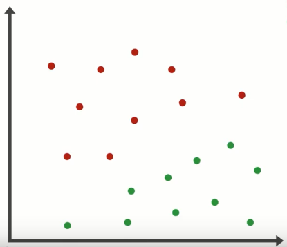
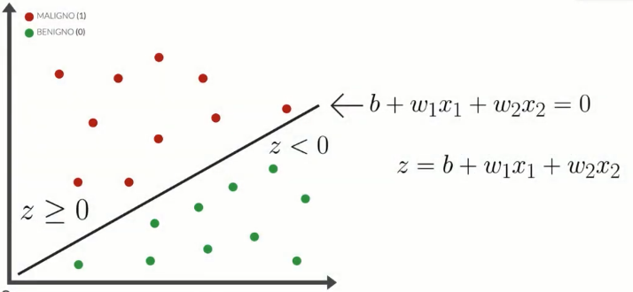

# Regresión logística binaria

La regresión logística es una técnica estadística esencial para modelar fenómenos donde el resultado es binario: éxito o fracaso, presencia o ausencia, sí o no. Si bien su nombre incluye "regresión", su objetivo principal es **clasificar** y **estimar probabilidades**, por eso también es ampliamente utilizada en machine learning como modelo de clasificación.

***

Explicaremos que es una regresión binaria a traves de un ejemplo, que no es una estrategia real, pero sirve para entender como se aplica en un contexto real.

Supongamos que estamos estudiando aperturas del mercado, y registramos para cada día:

* **Rango del primer minuto** (máximo - mínimo)

* **Dirección** (cierre - apertura)

* Y codificamos de forma binaria: **¿El precio subió al menos 5 puntos en los siguientes 10 minutos?**

    - Sí (éxito = 1)

    - No (fracaso = 0)

 Tendremos una tabla como la siguiente:
 
 | Rango | Dirección | Subió |
|-----------|--------------|---------|
| 1.5 | -1.2 | No|
| 2.6| 1.8 | Si |
|..... |..... |..... |

Graficamos y obtenemos:

 
 

### ¿Podemos encontrar una forma de separar los exitos de los fracasos?

A simple vista, parece que hay cierta zona donde se acumulan los verdes, y otra con más rojos.

Lo que queremos es **encontrar una línea**, una frontera, que nos diga:
    - Si las condiciones del setup están de este lado, probablemente sea un exito.
    - Si están del otro, probablemente sea un fracaso.

### ¿Cómo lo hacemos?

Podríamos intentar usar una recta como la siguiente:

$z(X) = b ​+w_1​* x_1 + w_2​ * x_2$
donde  $X = \{x_1, x_2, ..., x_n \}$

Esa recta nos devuelve un número que puede valer:

z = 0: sobre la recta
z > 0: arriba de la recta
z < 0: debajo de la recta

z∈(−∞,+∞)

Aunque z permite separar los puntos, **no  es una probabilidad**. Si queremos saber **con qué probabilidad un punto pertenece a la clase 1**, debemos transformar z con una función especial, llamada **función logística**.

***

## La función logística

Aplicamos una función que transforma cualquier número de z en un valor **entre 0 y 1**.
Ese valor ahora **sí podemos interpretarlo como una probabilidad**.
$$π(x)=\frac{1}{1+e^{-z(X)}}$$
Ahora el contorno no es un muro, sino una zona de inflexión donde la función logística transita gradualmente del exito al fracaso.

$\pi(x)$ representa la probabilidad de éxito dado un determinado estado (X)
$\pi(x) = P (éxito | X)$ donde  $X = \{x_1, x_2, ..., x_n \}$

Despejando de la ecuacion anterior:

$ln \frac {\pi(X)}{1 - \pi(X)} = z(X)$

### ¿Con qué probabilidad este setup tiene éxito, dadas sus condiciones técnicas?

Podemos imaginarlo así:

* Para valores de z muy negativos, la probabilidad π(x) se acerca a 0 entonces el modelo está casi seguro de que **es un fracaso**.

* Para valores de z muy positivos, π(x) se acerca a 1 entonces el modelo está convencido de que **es un éxito**.

* Para valores de z cercanos a 0, π(x) se acerca a 0.5  entonces el modelo está **indeciso**, estamos en la **zona de transición**.

Esa transición suave es una de las ventajas del modelo logístico: no clasifica de forma tajante, sino que asigna una **probabilidad**, lo que nos permite tomar decisiones más informadas según el nivel de certeza que exijamos.

***

## Clasificación con un umbral

Una vez que obtenemos π(x), es decir, la probabilidad estimada de que el precio suba, podemos usar un **umbral de decisión** para clasificar:

* Si π(x) > 0.5: clasificamos como **éxito** (el setup probablemente funciona).

* Si π(x) ≤ 0.5: clasificamos como **fracaso** (mejor evitarlo).

Este umbral no tiene que ser siempre 0.5. Podemos ajustarlo según el contexto:

* Si queremos minimizar riesgos, podemos exigir π(x)>0.7.

* Si preferimos capturar más oportunidades aunque algunas fallen, podríamos aceptar π(x)>0.4.

De esta manera, el modelo no solo **separa los datos**, sino que también nos informa **qué tan seguros podemos estar** al tomar una decisión basada en él.

***
## Interpretación de los coeficientes

Los valores w1​, w2​ y b (también llamados β1​, β2​, β0​) son los parámetros del modelo. Una vez entrenado, el modelo nos dice:

* Cuánto **influye el rango** (x₁) en la probabilidad de éxito.

* Cuánto **influye la dirección** (x₂).

* Y el término b ajusta el desplazamiento de la curva.

Cada coeficiente puede interpretarse así:

* Si $w_1$​ > 0, entonces cuanto mayor sea el rango del primer minuto, mayor será la probabilidad de éxito.

* Si $w_2$ ​< 0, entonces una dirección negativa reduce la probabilidad de éxito.

Estas interpretaciones nos ayudan a **comprender qué variables tienen más peso** en la decisión, y si el modelo está aprendiendo algo coherente con nuestra intuición o experiencia.

***

### Notas conceptuales

* Lo que llamamos “rango” y “dirección” en este ejemplo se conocen formalmente como **variables predictoras** o **features**.

* El resultado que buscamos (¿subió o no?) es la **variable de respuesta** o **target**.

* El modelo que usamos se llama **regresión logística binaria**, y pertenece a la familia de **modelos lineales generalizados**.

* El proceso de construir esta fórmula a partir de datos se llama **entrenamiento supervisado**, y el objetivo es **clasificar** cada caso en una de dos clases: éxito (1) o fracaso (0).

***