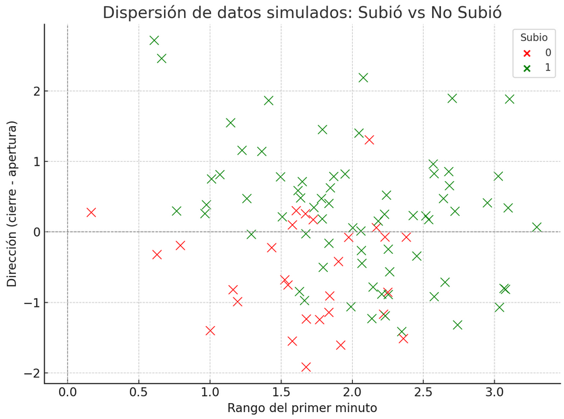
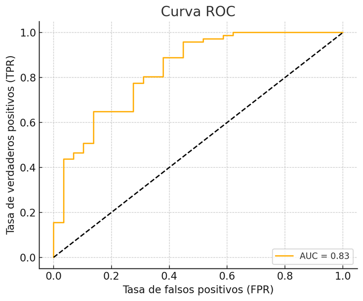

# Entrenamiento de una regresión logística con datos simulados

En el módulo anterior entendimos qué hace una regresión logística binaria desde lo conceptual. Ahora vamos a entrenar un modelo real (aunque con datos simulados), ver cómo ajusta los parámetros, y evaluar qué tan bien clasifica los casos. Esto nos permitirá:
* Ver cómo el modelo aprende los coeficientes.
* Observar qué tan bien predice los resultados.
* Introducir conceptos como verosimilitud, error de clasificación, y ajuste.
* Prepararnos para temas más avanzados como evaluación con curva ROC y uso de umbrales personalizados.

## Paso 1: Análisis del gráfico
Vamos a simular 100 días de apertura de mercado con tres columnas. Estos datos tienen una estructura donde mayores valores de rango y dirección positiva tienden a asociarse con éxito, y viceversa.

#### Ver los puntos en el plano es fundamental para:

* Saber si **una separación lineal tiene sentido**.
* Intuir si el modelo **va a funcionar o no**.
* Visualizar **zonas de ambigüedad** donde los casos se mezclan.

#### ¿Qué se observa?

* Los puntos **verdes** tienden a estar en la zona superior derecha (mayor rango y dirección positiva).
* Los puntos **rojos** se agrupan más hacia abajo e izquierda.
* Hay cierta franja intermedia donde se mezclan, pero en general **sí parece que una recta podría separar las clases** de forma razonable.

Esto confirma que **una regresión logística binaria tiene sentido en este contexto**, y será capaz de encontrar una frontera de decisión útil.

***

## Paso 2: Ajuste del modelo

$ln \frac{π(X)}{1−π(X)​} = −2.136 + 1.81 * Rango + 1.58 * Direccion$

siendo $X = \{Rango, Direccion\}$

#### Interpretación de coeficientes:

* **Intercepto**: –2.136

* **Rango**: coeficiente positivo (1.81)
Cuanto mayor es el rango del primer minuto, mayor es la probabilidad de que el precio suba.

* **Dirección**: también positivo (1.58)
Una dirección más alcista también aumenta la probabilidad de éxito.

Ambos coeficientes son **significativos** (p-valor < 0.05), lo que indica que estas variables aportan información real al modelo.

#### ¿Cómo se calculan los coeficientes?

Se buscan los valores de los coeficientes que hagan **más probable observar los datos que realmente vimos**. Esto se llama **Estimación por máxima verosimilitud**.

### Paso 3: Visualización del modelo entrenado

Una vez entrenado el modelo, podemos ver:

* Tabla con π(x) para cada caso → ver qué tan bien predice
* Gráfico de dispersión con frontera de decisión
* Errores de clasificación: ¿cuántos aciertos? ¿cuántos falsos positivos/negativos?

### Paso 4: Evaluación del modelo

Una vez entrenado el modelo y obtenidas las probabilidades estimadas π(x), podemos evaluar qué tan bien clasifica los casos reales. Para eso usamos dos herramientas clave: la **matriz de confusión** y la **curva ROC**.

#### Matriz de confusión

Esta matriz compara las clases reales con las clases predichas (según un umbral de 0.5):

|                     | Predijo No Subió | Predijo Subió |
| ------------------- | ---------------- | ------------- |
| **No Subió (real)** | 16               | 13            |
| **Subió (real)**    | 6                | 65            |

* **Verdaderos positivos**: 65 días en los que el modelo dijo "sube", y efectivamente subió.
* * **Verdaderos negativos**: 16 aciertos en decir "no sube".
* **Falsos positivos**: 13 veces dijo "sube", pero no subió.
* **Falsos negativos**: 6 veces dijo "no sube", pero sí subió.

En total, el modelo **acierta en 81 de 100 casos**, pero lo más interesante es cómo se comporta con distintos tipos de error, que analizamos mejor con la curva ROC.

#### Curva ROC y AUC

La curva ROC muestra cómo varía la sensibilidad del modelo (verdaderos positivos) frente a la tasa de falsos positivos, al cambiar el umbral de decisión.

* Cuanto más arriba y a la izquierda esté la curva, mejor clasifica el modelo.

* La AUC (área bajo la curva) resume ese rendimiento:
En este caso, AUC = 0.83 → Muy buen poder de discriminación.

#### Conclusión de la evaluación

* El modelo logra un buen equilibrio entre aciertos y errores.
* Predice con alta probabilidad cuando hay señales claras (alto rango y dirección positiva).
* En la franja de ambigüedad comete errores, como es esperable.
* Su AUC de 0.83 confirma que el modelo aprendió una relación útil.

## Notas conceptuales del entrenamiento

* **Entrenar un modelo** significa ajustar sus parámetros (coeficientes) usando datos observados.

* En regresión logística, los coeficientes b,w1​,w2​ se eligen para que el modelo **maximice la verosimilitud**: es decir, para que las probabilidades asignadas a cada caso real sean lo más altas posible.

* A este proceso se lo llama **estimación por máxima verosimilitud**.

* El modelo entrenado devuelve una **probabilidad estimada de éxito** para cada combinación de variables.

* Esa probabilidad se convierte en una clase (0 o 1) usando un **umbral de decisión**, típicamente 0.5.

* La comparación entre clase real y clase predicha se resume en una **matriz de confusión**.

* Las métricas más comunes son:

  * **Verdaderos positivos (VP)**: aciertos cuando predice clase 1 y realmente es 1.

  * **Falsos positivos (FP)**: errores cuando predice 1 y era 0.

  * **Falsos negativos (FN)**: errores cuando predice 0 y era 1.

  * **Verdaderos negativos (VN)**: aciertos cuando predice 0 y era 0.

* Para evaluar el modelo con distintos umbrales se usa la **curva ROC**, que muestra la relación entre la tasa de verdaderos positivos (sensibilidad) y la de falsos positivos.

* El **AUC** (Área Bajo la Curva ROC) mide cuán bien el modelo distingue entre clases. Un AUC de 0.83 indica muy buena capacidad de clasificación.

